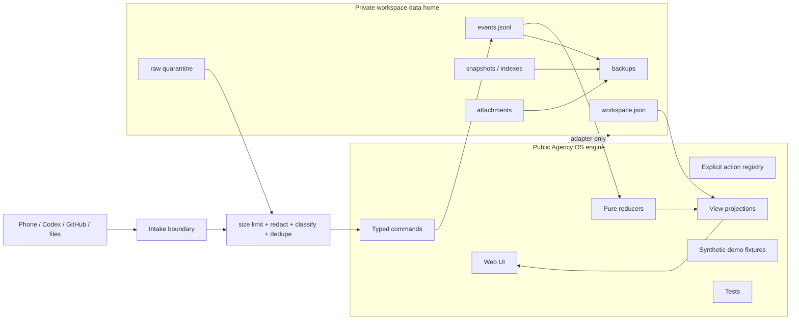

# Agency OS: Strategic Hardening and Product Plan

Status: accepted strategic roadmap; current facts remain in `CURRENT_STATE.md`
Prepared: 2026-07-26
Adopted for staged execution: 2026-07-28
Audited baseline: `main` at `2c9139d`
Scope: local-first Agency OS after capture, review, event-log, backup and restore work

## 1. Purpose

This document packages the findings of a read-only product, architecture,
security and UX audit into an executable development route.

It does not replace:

- `PRODUCT_DNA.md`;
- `AGENCY_OS_ARCHITECTURE.md`;
- `DATA_MODEL_AND_INVARIANTS.md`;
- `SECURITY_AND_APPROVALS.md`;
- `NEXT_AGENT_HANDOFF.md`.

Those documents remain valuable sources of intent, policy and history. This
sidecar plan answers a narrower question:

> What should Agency OS build next, and in what order, so that it becomes a
> trustworthy daily-use product without losing its original DNA?

No existing project document was changed while preparing this plan.

## 2. Executive Decision

Agency OS should not expand into more integrations or entity types yet.

Its next phase should be a hardening and product-convergence phase:

```text
private data boundary
-> request-fresh truth
-> reliable local persistence
-> short phone review loop
-> self-observation importer
-> hosted or external integrations
```

The project is currently best described as:

```text
v0.3 Supervised Local Staging
```

It is not yet:

- approved for real personal-memory daily use;
- safe for storing real personal memory in a public Git working tree;
- safe for LAN, tunnel or hosted exposure;
- a production Launch Candidate;
- ready for autonomous write integrations.

The strongest product promise remains:

> After hours or days away from a project, open Agency OS and understand within
> one minute what actually changed, what can be trusted, what needs a decision
> and what single physical action comes next.

This promise should govern the next milestones.

## 3. Product DNA to Preserve

Agency OS is not:

- another team chat;
- a general task manager;
- an agent runtime;
- a workflow builder;
- a replacement for Codex, GitHub, Claude or OpenClaw;
- a universal shared workspace.

Agency OS is:

- a local-first personal truth ledger;
- a portfolio-level memory and verification layer;
- a review surface between the builder and multiple agents/tools;
- a short-session interface for capture, verification, decisions and next
  actions;
- an evidence-aware answer to “where am I, what changed and what is real?”.

The core loop remains:

```text
Intent
-> Plan
-> Action
-> Evidence
-> Verification
-> State
-> Review
-> Next Action
```

This positioning remains differentiated from broad human-agent workspaces such
as Buzz, which combines rooms, agents, workflows and Git events in a shared
event protocol:

- <https://github.com/block/buzz>

Codex already provides execution, remote steering, approvals, diffs and mobile
access. Agency OS should synthesize durable meaning across that work rather
than recreate agent execution controls:

- <https://openai.com/index/work-with-codex-from-anywhere/>

## 4. Audited Baseline

At the time of the audit:

- canonical repo: `C:\Agency_os_first\AGENCY_OS_FIRST`;
- branch: `main`;
- commit: `2c9139d`;
- local and `origin/main` were synchronized;
- working tree was clean before this sidecar file was created;
- `npm run verify` passed;
- lint, typecheck and build passed;
- 74 tests passed;
- the browser UI was inspected at desktop and mobile widths;
- `npm run audit:prod` remained blocked by three high-severity advisories in
  the stable Next dependency chain through PostCSS and sharp.

Existing strengths:

- append-only JSONL events;
- event replay into derived state;
- sequence, idempotency and hash-chain checks;
- scoped approvals and person-only write seams;
- capture creation and capture review;
- smoke paths using temporary ledgers;
- backup, dry-run restore and safety backups;
- coordinator/worker development protocol;
- extensive evidence and task artifacts.

## 5. Critical Findings

### P0. Public source and private runtime data share one Git tree

The public repository tracks:

- `data/events.jsonl`;
- project, actor, approval and evidence snapshots;
- task logs and screenshots;
- local paths inside historical evidence.

The capture API persists the raw note body with
`redactionStatus: "pending_scan"`. The status is currently a label, not a
scan-before-persist boundary. The automatically generated idempotency key also
contains normalized raw note text.

Consequences:

- a personal note or secret can enter Git history;
- later `git add`, commit and push can publish private memory;
- backups reproduce the same raw payload;
- task artifacts reveal local filesystem details.

Decision:

> Before real dogfooding, separate the public engine from the private runtime
> workspace.

### P0. The rendered dashboard is not fully request-fresh

`page.tsx` obtains a fresh runtime ledger for capture/review, but several
portfolio, evidence, recommendation and event view models are exported from
module-level derived constants.

A successful write followed by reload may therefore show a mixture of new and
old state until the server process reloads.

Decision:

> One request must load one runtime snapshot, replay it once and derive every
> visible view model from that same snapshot.

### P0. A false queue count is visible

When there are no uncategorized captures, the phone queue substitutes the
number of sanity checks. The browser can therefore show:

```text
Triage captures: 4
No captures
```

This violates the project rule against false progress and false affordances.

Decision:

> Counts must be literal counts of their named entities. Zero means zero.

### P1. Local write routes have no exposure boundary

Current local POST routes:

- bind the actor to `person-serj`;
- do not enforce an authenticated session;
- do not validate Origin;
- have no explicit request-size or rate limit;
- accept client timestamps with minimal plausibility checks;
- report most writer failures as HTTP 400.

This is acceptable only while the application is explicitly loopback-local.

Decision:

> Fail closed outside loopback until hosted authentication and actor binding
> are designed.

### P1. Restore and lock recovery need hardening

Current restore copies the event log directly to the target after making a
safety backup.

Missing:

- coordination with the writer lock;
- temporary-file write plus atomic replace;
- stale-lock recovery after a process crash;
- full workspace compatibility validation;
- snapshot and attachment coverage;
- schema/repo version in the restore decision.

### P1. Unknown event classification is convention-based

Unsupported state-changing actions are detected with a naming regular
expression. A novel action name outside the recognized suffix convention may
be silently treated as informational.

Decision:

> Replace convention-based detection with an explicit action registry:
> supported reducers, known informational actions and reject-by-default for all
> unknown actions.

### P1. There are multiple competing “current state” documents

The handoff, start brief, README, development flow, evidence log and
architecture document can describe different next steps or implementation
states.

Decision:

> Introduce one compact current-state manifest. Long documents remain policy
> and history, but only the manifest answers “where are we now?”.

### P2. Phone mode is a long desktop dashboard

At a 390 x 844 viewport:

- capture is visible early;
- review starts below the first screen;
- the full page is roughly 10,000 pixels tall;
- the complete desktop portfolio follows the phone panel.

This is not yet a seven-minute phone mode.

### P2. Desktop layout breaks at a common width

At 1280 pixels, the next-action submit button overflows its primary panel and
visually intersects the adjacent panel. The major responsive breakpoint only
changes the layout below 1180 pixels.

### P2. Static content looks live

“Signals captured today”, “Tonight focus” and similar blocks include seed
content that is not derived from current events or the current date.

Decision:

> A block is either derived truth, clearly marked demo content, or removed.

## 6. Target Architecture



Recommended private data home on Windows:

```text
%LOCALAPPDATA%\AgencyOS\workspaces\<workspace-id>\
```

Recommended development override:

```text
AGENCY_OS_DATA_DIR=<absolute-private-path>
```

The repository should contain only:

- application code;
- schemas and reducers;
- synthetic demo fixtures;
- tests;
- documentation;
- explicitly sanitized public evidence.

## 7. Simplified Product Shape

### Phone

Use three first-level surfaces:

```text
Capture | Review | Today
```

#### Capture

- one raw note or fact;
- project or Inbox;
- immediate local confirmation;
- no forced classification.

#### Review

- one item at a time;
- candidate type;
- dismiss;
- mark sensitive;
- request evidence;
- no automatic conversion without an explicit command.

#### Today

- one recommended physical action;
- blockers requiring a decision;
- verified changes since the last review;
- small count of outstanding review items.

### Desktop

Use the desktop interface for drill-down:

- portfolio;
- evidence and claims;
- agent runs;
- event/provenance inspection;
- integration health;
- history and audit.

Do not render every desktop module after the phone flow on a small screen.

### One UI-level review abstraction

Present one `ReviewItem` concept to the user while keeping typed domain entities
underneath:

```text
capture candidate
evidence request
agent claim
blocker decision
approval request
```

This reduces cognitive load without weakening the domain model.

## 8. Implementation Program

Each milestone is a coordinator-managed train of bounded branches. Workers do
not merge or push `main`.

### Milestone 0 — Adopt the plan

Goal:

- review this sidecar plan against current code;
- record accepted, rejected and deferred decisions;
- make the chosen sequence canonical.

Suggested branch:

```text
docs/adopt-strategic-hardening-plan
```

Done criteria:

- decisions are explicit;
- the next P0 slice is named;
- no product code changes;
- `git diff --check` passes;
- coordinator merges and pushes after review.

### Milestone 1 — Private runtime data boundary

#### Slice 1A: Data-home contract

Suggested branch:

```text
feature/private-data-home-contract
```

In scope:

- define public fixture versus private runtime data;
- define `AGENCY_OS_DATA_DIR`;
- define workspace directory layout;
- define missing/invalid data-home behavior;
- define migration and rollback rules;
- define which task artifacts may be public.

Out of scope:

- moving real user data;
- hosted storage;
- encryption implementation;
- integrations.

#### Slice 1B: Runtime path adapter

Suggested branch:

```text
feature/private-runtime-path-adapter
```

In scope:

- centralize all runtime paths;
- make read/write/backup/restore use the adapter;
- keep tests on temporary data homes;
- keep synthetic demo fixtures in the repo;
- fail clearly when a configured data home is inaccessible.

Done criteria:

- normal capture does not dirty the Git working tree;
- `data/events.jsonl` is no longer the production runtime target;
- smoke tests prove repository files stay unchanged;
- `npm run verify` passes.

#### Slice 1C: Migration command

Suggested branch:

```text
feature/private-data-home-migration
```

In scope:

- dry-run;
- pre-migration backup;
- integrity validation;
- explicit confirmation;
- copy to private data home;
- verify hashes;
- leave source unchanged until completion is proven.

Stop if any real data ownership or deletion choice is unclear.

### Milestone 2 — Intake privacy and route safety

#### Slice 2A: Safe capture identity

- replace raw-body idempotency with a stable cryptographic digest;
- add maximum body size;
- reject implausible timestamps;
- distinguish user validation errors from internal writer failures.

#### Slice 2B: Real redaction boundary

- scan before normal projection;
- store sensitive raw content only in private quarantine;
- normal views receive a safe summary or placeholder;
- block `pending_scan` and `blocked_sensitive` content from normal summaries;
- test common secret shapes without logging the secret.

#### Slice 2C: Loopback guard

- document and enforce local-only exposure;
- validate Origin where appropriate;
- fail closed on non-loopback host configuration;
- keep hosted auth as a later explicit architecture decision.

Done criteria:

- real capture text cannot enter Git-tracked files;
- raw text is absent from idempotency keys and logs;
- remote exposure is blocked by default;
- sensitive fixtures do not appear in rendered output or test logs.

### Milestone 3 — One request, one truth

Suggested branch train:

```text
feature/request-scoped-ledger-view
fix/literal-review-counts
fix/runtime-truth-regressions
```

In scope:

- load one runtime ledger per request;
- replay once;
- derive projects, evidence, queues, recommendations, metrics and events from
  the same snapshot;
- eliminate module-level runtime projections;
- remove fallback counts;
- remove or clearly mark static “today” content;
- add post-write reload tests.

Done criteria:

- a write followed by reload shows the new state everywhere;
- no server restart is required;
- zero captures renders zero captures;
- tests cover mixed-stale-state regressions.

### Milestone 4 — Persistence and recovery hardening

Suggested branch train:

```text
feature/atomic-ledger-restore
feature/stale-lock-recovery
feature/workspace-backup-manifest
```

Requirements:

- restore takes the same exclusive lock as writers;
- restore writes a temporary file, flushes it and atomically replaces target;
- stale locks record owner/time and have a safe recovery command;
- backup includes schema version, app commit, event hash, snapshot hashes and
  attachment inventory;
- restore rejects incompatible or incomplete bundles;
- tests simulate interrupted restore and concurrent write attempts.

Done criteria:

- a failed restore leaves the original ledger intact;
- a crashed writer can be recovered without manual file deletion;
- a backup is self-describing and independently verifiable;
- recovery drill is documented and reproducible.

### Milestone 5 — Explicit action registry

Replace regex-based state-change inference with:

```text
supported reducer action
known informational action
unknown action -> reject
```

The registry should declare:

- action name;
- schema version;
- entity type;
- actor policy;
- approval policy;
- redaction policy;
- reducer;
- idempotency scope;
- allowed view projections.

Done criteria:

- every known action is registered;
- all unknown actions fail closed;
- informational actions require explicit registration;
- registry tests prevent accidental silent ignores.

### Milestone 6 — Current-state documentation manifest

Suggested artifact:

```text
docs/CURRENT_STATE.yaml
```

Example:

```yaml
stage: v0.3-supervised-local-staging
verified_commit: <commit>
verified_tests: 77
runtime_data_mode: public-git-staging
implemented_actions:
  - project.next_action_updated
  - capture.note_created
  - capture.review_marked
blocked:
  - production-deploy
next_milestone: state-synchronization-and-private-runtime-hardening
```

Rules:

- the manifest is current truth;
- handoff references it;
- architecture documents describe target design;
- evidence log remains historical;
- CI checks obvious freshness contradictions.

### Milestone 7 — Phone-loop convergence

Suggested branch train:

```text
feature/phone-navigation-shell
feature/phone-review-one-at-a-time
feature/today-delta-view
fix/desktop-command-layout
```

Requirements:

- Capture, Review and Today are first-level phone views;
- no full desktop dashboard is appended to phone mode;
- review handles one item at a time;
- desktop 1280 layout has no overflow;
- visible counts are literal;
- focus-visible, keyboard, reduced-motion and contrast checks are included.

Success criteria:

- capture a thought in under 30 seconds;
- review one item in under 60 seconds;
- understand current next action in under 60 seconds;
- first useful action is visible without a long scroll;
- browser QA covers at least 390, 760, 1024, 1280 and 1440 widths.

### Milestone 8 — First read-only self-observation importer

Do not start with Telegram.

First importer:

```text
Codex task artifacts + Git commits + verify results
```

Why:

- no OAuth;
- no external write permissions;
- existing evidence already has task, plan, tests, commit and handoff;
- Agency OS can dogfood by observing its own construction;
- this directly validates the evidence-ledger promise.

Importer output:

- proposed events only;
- provenance link to source artifact;
- dedupe key;
- confidence;
- no automatic verification;
- no automatic state mutation without review.

Done criteria:

- importer is read-only;
- malformed/untrusted artifact text cannot execute instructions;
- duplicate imports are stable no-ops;
- user sees a concise “what changed since last review?” delta.

### Milestone 9 — Public and hosted readiness

Only after prior gates:

- resolve production dependency audit without a breaking force fix;
- add `LICENSE`;
- add `SECURITY.md`;
- add minimal contribution policy if the repo remains public;
- protect `main` or require the Verify workflow;
- enable dependency security update workflow;
- define hosted identity, storage and backup architecture;
- perform a threat-model review;
- perform a restore drill from an off-machine backup.

Do not deploy merely because the build succeeds.

## 9. Release Gates

### Local dogfooding gate

Required:

- private runtime data home;
- capture does not dirty Git;
- request-fresh projections;
- literal queue counts;
- working backup and restore drill;
- loopback-only enforcement;
- all tests green.

### Personal remote-access gate

Required:

- authenticated session;
- actor derived from authenticated identity;
- Origin/CSRF protection;
- encrypted transport;
- private storage;
- request limits;
- recovery plan;
- no high production dependency findings.

### External integration gate

Required:

- read-only first;
- least privilege;
- untrusted input quarantine;
- explicit provenance;
- stable dedupe;
- human review before state mutation;
- revoke/kill switch.

### Production gate

Required:

- security audit green;
- full backup/restore drill;
- monitoring and audit trail;
- protected release process;
- documented data ownership and deletion behavior;
- no public fixture/private data ambiguity.

## 10. Product Measurement

Avoid measuring progress by number of entities, routes or integrations.

Measure:

- time to reconstruct context after one day away;
- time to identify the one next physical action;
- percentage of captures reviewed within 24 hours;
- percentage of agent claims with usable evidence;
- number of stale or contradictory states found;
- number of recommendations accepted versus ignored;
- number of times Agency OS prevented duplicate or misdirected work;
- number of manual systems the user no longer needs to inspect.

Recommended primary metric:

```text
median time from opening Agency OS to choosing a trusted next action
```

## 11. What Not to Build Yet

Defer:

- Telegram bot;
- multi-agent orchestration runtime;
- general workflow builder;
- automatic creation of evidence/blockers/decisions from raw captures;
- GitHub write actions;
- multi-user collaboration;
- multi-tenant database;
- broad framework migration;
- hosted deployment;
- AI-generated recommendations without transparent supporting state.

Each of these becomes cheaper and safer after the private data, truth and phone
loop milestones.

## 12. Working Protocol for Agents

For every milestone:

```text
PLAN FIRST
-> one bounded branch/worktree slice
-> focused verification
-> full canonical verification
-> independent no-edit review
-> handoff
-> coordinator merge/push
-> stop
```

PLAN FIRST must state:

- goal;
- in scope;
- out of scope;
- done criteria;
- evidence;
- expected files;
- stop conditions.

Worker rules:

- do not move or push `main`;
- do not deploy;
- do not expand the milestone;
- do not silently change storage/auth/framework strategy;
- do not use reviewer scores as permission to add features;
- stop when a product or data-ownership decision is required.

Coordinator rules:

- verify the worker diff rather than trusting the summary;
- merge only one clean slice at a time;
- run `npm run verify` in the canonical repo;
- keep the current-state manifest and handoff truthful;
- push only after verification;
- preserve a rollback point.

## 13. Recommended Immediate Next Step

The first implementation task should be:

```text
Private runtime data-home contract
```

It is intentionally a contract slice before code.

Questions it must settle:

1. Exact Windows default data location.
2. Workspace directory layout.
3. Demo fixture versus private runtime rules.
4. Behavior when the data home is missing, invalid or read-only.
5. Migration, backup and rollback sequence.
6. Which evidence artifacts may be public.
7. Whether raw quarantine is plain local storage or encrypted at rest in the
   first daily-use version.

Recommended default:

```text
%LOCALAPPDATA%\AgencyOS\workspaces\default\
```

Recommended initial encryption decision:

- do not invent custom encryption;
- keep the first version local and OS-user protected;
- prevent Git tracking and remote exposure;
- evaluate OS-backed secret/encryption support before personal remote access.

## 14. Prompt for the Next Coordinator Agent

Copy the following prompt into the new Agency OS coordinator/consultant chat:

```text
Use C:\Agency_os_first\AGENCY_OS_FIRST.

Act as the Agency OS coordinator and architecture reviewer, not as an
unbounded implementation worker.

Read completely before proposing work:
- AGENTS.md
- docs/AGENT_START_BRIEF.md
- docs/NEXT_AGENT_HANDOFF.md
- docs/PRODUCT_DNA.md
- docs/STRATEGIC_HARDENING_AND_PRODUCT_PLAN.md
- docs/DATA_MODEL_AND_INVARIANTS.md
- docs/REDACTION_AND_IMPORT_BOUNDARIES.md
- docs/EVENT_LOG_INTEGRITY.md
- docs/SECURITY_AND_APPROVALS.md

Inspect the current authoritative state:
- git status
- git log -1 --oneline
- package.json
- current runtime path/read/write/backup/restore code
- current test coverage relevant to runtime data paths

Do not code yet.

First provide a concise adoption review of
docs/STRATEGIC_HARDENING_AND_PRODUCT_PLAN.md:
1. Which findings are confirmed by current code?
2. Which findings are obsolete or incorrect?
3. Which recommendations should be accepted, changed, deferred or rejected?
4. What product/data-ownership decisions require the user's approval?
5. What is the smallest safe branch/worktree train for Milestone 1:
   Private runtime data boundary?

Preserve the product DNA:
Agency OS is a local-first truth, evidence, review and next-action layer. It is
not a general agent runtime, chat workspace or workflow builder.

Priority order:
1. Private runtime data boundary.
2. Request-fresh truth and literal counts.
3. Route, restore and lock hardening.
4. Explicit action registry and one current-state manifest.
5. Phone-loop convergence.
6. Read-only self-observation importer.
7. Hosted access and external integrations only after their gates.

Hard constraints:
- do not deploy;
- do not add GitHub, Telegram, Codex or OpenClaw integrations yet;
- do not move or push main as a worker;
- do not mutate or migrate real data without an approved migration plan,
  backup and rollback;
- do not change framework/auth/storage strategy silently;
- do not rewrite existing architecture documents before the adoption review;
- do not chase a reviewer score by expanding scope.

After the adoption review, wait for approval.

When approved, prepare exactly one worker task for:

branch:
feature/private-data-home-contract

worktree:
C:\Agency_os_first\worktrees\private-data-home-contract

The first slice is documentation and contract only. It must define:
- public engine versus private runtime data;
- AGENCY_OS_DATA_DIR;
- Windows default data-home path;
- workspace directory layout;
- fail-closed behavior;
- migration, backup and rollback rules;
- public task-artifact sanitation rules;
- acceptance tests for the later runtime adapter.

The worker must update docs/NEXT_AGENT_HANDOFF.md, run git diff --check,
commit and stop. The coordinator owns review, canonical npm run verify, merge
and push.
```

## 15. Final Recommendation

Do not use the next cycle to make Agency OS broader.

Use it to make the core promise more truthful:

```text
private memory
+ fresh state
+ short review
+ visible provenance
= trusted next action
```

If that loop works every day for its owner, integrations become leverage.
Without it, integrations only produce more unverified state.
