# Agency OS FULL MVP Planning Package

Status: accepted implementation plan, not an implemented FULL MVP
Prepared: 2026-07-29

## What This Package Is

This package turns Agency OS product DNA into an executable, reviewable
implementation program for:

```text
Agency OS v0.4 — Private Local Dogfood MVP
```

It is deliberately not a promise that one unattended night will finish the
product. The graph estimates about 55 automated task-hours and a 27.5-hour
dependency critical path before review/repair variance. One authorized window
may produce meaningful verified progress; later windows resume the same durable
goal state.

The honest unattended completion boundary is:

```text
Automated FULL MVP implementation candidate completed;
manual acceptance gates remain.
```

FULL private-dogfood acceptance additionally requires H01-H04:

- physical phone plus private Tailscale path;
- manual accessibility on desktop and phone assistive technology;
- clean-machine/profile backup recovery;
- non-mutating scan of one real allow-listed Git repository.

Production remains closed while the known Next/PostCSS/sharp audit finding is
unresolved.

## Read Order

1. `01_PRODUCT_AND_UX_CONTRACT.md` — product DNA, journeys, screens, states and
   release meaning.
2. `02_ARCHITECTURE_AND_MODULES.md` — module boundaries, event/evidence model,
   local runtime, security and recovery.
3. `03_IMPLEMENTATION_DAG.md` — 33-task dependency plan, fixtures, manual gates
   and release review.
4. `04_AGENT_EXECUTION_REGIME.md` — worker/coordinator lifecycle, durable state,
   evidence, repairs and multi-window continuation.
5. `TASK_GRAPH.json` — machine-readable task/dependency/ownership authority.
6. `EXECUTION_SCHEMAS.json` — machine-readable receipts, reviews, run state and
   manual/release artifacts.
7. `05_OVERNIGHT_GOAL_PROMPT.md` — owner preflight and the launch prompt.
8. `scripts/validate-full-mvp-plan.mjs` and
   `scripts/validate-full-mvp-execution.mjs` — executable gates.

If prose and machine authority disagree, the run stops; it does not guess.

## Product DNA In One Sentence

Agency OS is a private, phone-first truth and evidence layer over fragmented
human/agent work: it tells the owner what changed, what is proven, what is
blocked and what deserves the next short session.

It is not another agent chat, project-management suite, autonomous orchestrator
or public collaboration workspace.

## Implementation Shape

```mermaid
flowchart LR
    H00["H00 owner authorization"] --> F["Foundations and security"]
    F --> D["Domain truth and event model"]
    D --> W["Workspace, recovery and Git observations"]
    W --> A["Commands, policy and local API"]
    A --> U["Phone-first and desktop truth UI"]
    U --> V["Automated candidate verification"]
    V --> H["H01-H04 human acceptance"]
    H --> R["R00 private-dogfood release review"]
```



Workers operate on isolated task branches/worktrees. The coordinator alone
merges into the local integration branch. `main`, GitHub and deployment remain
untouched unless the owner later grants separate authority.

## Evidence Boundary

The package distinguishes:

- `testedCommit`: the existing commit actually tested;
- `artifactCommit`: a later clean HEAD containing evidence/review artifacts.

Only certification paths may change between them. This avoids impossible
self-referential Git SHAs without allowing code to change under green evidence.

Every automated task requires focused commands, independent role reviews at
92+, a visible no-ff merge, post-merge aggregate verification and committed
coordinator acceptance. Repairs remain bound to the original contract and are
limited to two turns.

## Launch Preconditions

Do not launch until:

- this complete package is committed atomically;
- that resulting commit SHA is placed into the external H00 authorization as
  `planningCommit`;
- the canonical worktree is clean;
- coordinator preflight can create the detached authority worktree, pin it to
  `planningCommit` and prove it clean before any implementation dispatch;
- baseline validators and `npm run verify` pass;
- the owner supplies a bounded time window and accepts that completion is not
  guaranteed.

Run before launch:

```text
node scripts/validate-full-mvp-plan.mjs
node scripts/validate-full-mvp-execution.mjs --self-test
npm run verify
git diff --check
```

Then use `05_OVERNIGHT_GOAL_PROMPT.md`; do not improvise a shorter autonomous
prompt that omits authorization, durable state, evidence or stop conditions.

## Independent Planning Reviews

The final package was accepted by independent no-edit reviewers:

- Product DNA: 95/100;
- UX/journeys: 94/100;
- architecture/security: 95/100;
- execution readiness: 96/100.

Scores are planning evidence only. The executable gates remain authoritative,
and implementation/release reviewers must independently assess the future code.
