# Agency OS FULL MVP Planning Package

Status: corrective implementation-plan revision; independent re-acceptance pending
Prepared: 2026-07-29

## What This Package Is

This package turns Agency OS product DNA into an executable, reviewable
implementation program for:

```text
Agency OS v0.4 — Private Local Dogfood MVP
```

It is deliberately not a promise that one unattended night will finish the
product. The graph estimates about 56.6 automated task-hours. Its automated
dependency path is 32 hours and the end-to-end path through formative H05 is
32 hours 20 minutes, but neither is the practical duration: with only
the currently declared safe parallel pairs, automated execution has a
52.6-hour lower bound before review, merge, verification, repair and owner-gate
overhead. At 450 productive minutes per authorized window, that is at least
eight windows. Forty-four reviews add an estimated 660 reviewer-minutes,
coordination adds about 320 minutes, owner-role gates require 390 minutes, and
post-automation manual/release work totals 470 minutes. The operational
planning budget is therefore eleven windows, with
11-13 a more honest range before repairs. One authorized window may produce
meaningful verified progress; later windows resume the same durable goal state.

The honest unattended completion boundary is:

```text
Automated FULL MVP implementation candidate completed;
manual acceptance gates remain.
```

FULL private-dogfood acceptance additionally requires H01-H04:

- physical phone plus private Tailscale path;
- manual accessibility on desktop and phone assistive technology;
- clean-machine/profile backup recovery;
- non-mutating scan of one real allow-listed Git repository.

H05 is a separate formative owner/UX phone checkpoint after the first working
mobile/desktop/Today surfaces and before final U06 composition. It intentionally
pauses finishing work when real phone interaction is wrong; it is not a
substitute for final H01-H04 acceptance.

Production remains closed while the known Next/PostCSS/sharp audit finding is
unresolved.

## Read Order

1. `01_PRODUCT_AND_UX_CONTRACT.md` — product DNA, journeys, screens, states and
   release meaning.
2. `02_ARCHITECTURE_AND_MODULES.md` — module boundaries, event/evidence model,
   local runtime, security and recovery.
3. `03_IMPLEMENTATION_DAG.md` — 39-task dependency plan, fixtures, manual gates
   and release review.
4. `04_AGENT_EXECUTION_REGIME.md` — worker/coordinator lifecycle, durable state,
   evidence, repairs and multi-window continuation.
5. `TASK_GRAPH.json` — machine-readable task/dependency/ownership authority.
6. `EXECUTION_SCHEMAS.json` — machine-readable receipts, reviews, run state and
   controller checkpoints plus manual/release artifacts.
7. `05_OVERNIGHT_GOAL_PROMPT.md` — owner preflight and the launch prompt.
8. `06_GAP_AUDIT_AND_WINDOW_ROADMAP.md` — current product gaps, corrected
   bottlenecks and realistic multi-window milestones.
9. `scripts/validate-full-mvp-plan.mjs`,
   `scripts/full-mvp-controller.mjs`,
   `scripts/validate-full-mvp-controller.mjs`,
   `scripts/analyze-full-mvp-schedule.mjs`,
   `scripts/classify-production-audit.mjs` and
   `scripts/validate-full-mvp-execution.mjs` — executable gates.

If prose and machine authority disagree, the run stops; it does not guess.

The root `AGENTS.md` contains an explicit Owner-Authorized FULL MVP Goal Mode.
Without valid H00 authorization, its ordinary one-slice/v0.3 rules remain in
force. With valid H00, only the specifically listed workflow limits are
replaced by this package; safety prohibitions remain.

## Product DNA In One Sentence

Agency OS is a private, phone-first truth and evidence layer over fragmented
human/agent work: it tells the owner what changed, what is proven, what is
blocked and what deserves the next short session.

It is not another agent chat, project-management suite, autonomous orchestrator
or public collaboration workspace.

## Implementation Shape

```mermaid
flowchart LR
    H00["H00 owner authorization"] --> F["Foundations and security"]
    F --> D["Domain truth and event model"]
    D --> W["Workspace, recovery and Git observations"]
    W --> A["Commands, policy and local API"]
    A --> U["Phone-first and desktop truth UI"]
    U --> V["Automated candidate verification"]
    V --> H["H01-H04 human acceptance"]
    H --> R["R00 private-dogfood release review"]
```



Workers operate on isolated task branches/worktrees. The coordinator alone
merges into the local integration branch. `main`, GitHub and deployment remain
untouched unless the owner later grants separate authority.

## Evidence Boundary

The package distinguishes:

- `testedCommit`: the existing commit actually tested;
- `artifactCommit`: a later clean HEAD containing evidence/review artifacts.

Only certification paths may change between them. This avoids impossible
self-referential Git SHAs without allowing code to change under green evidence.

Every automated task requires focused commands, independent role reviews at
92+, a visible no-ff merge, post-merge aggregate verification and committed
coordinator acceptance. Repairs remain bound to the original contract and are
limited to two turns.

## Launch Preconditions

Do not launch until:

- this complete package is committed atomically;
- that resulting commit SHA is placed into the external H00 authorization as
  `planningCommit`;
- the canonical worktree is clean;
- coordinator preflight can create the detached authority worktree, pin it to
  `planningCommit` and prove it clean before any implementation dispatch;
- baseline validators and `npm run verify` pass;
- the owner supplies a bounded time window and accepts that completion is not
  guaranteed.

Run before launch:

```text
node scripts/validate-full-mvp-plan.mjs
node scripts/validate-full-mvp-execution.mjs --self-test
node scripts/validate-full-mvp-controller.mjs
node scripts/analyze-full-mvp-schedule.mjs
node scripts/classify-production-audit.mjs
npm run verify
git diff --check
```

`classify-production-audit.mjs` is the trusted fail-closed gate while the
stable Next release still contains the already documented
`next -> postcss/sharp` advisory set. It passes only when the audit is clear or
when the exact known three-package/high-severity set is unchanged. The latter
classification remains `BLOCKED_KNOWN_UPSTREAM` and continues to prohibit
production release. Any package, count, path or severity drift fails.

Then use `05_OVERNIGHT_GOAL_PROMPT.md`; do not improvise a shorter autonomous
prompt that omits authorization, durable state, evidence or stop conditions.

## Independent Planning Reviews

Earlier 95/94/95/96 reviews apply only to the superseded planning revision.
This corrective revision changes the graph, execution schemas and controller
and is therefore **pending independent re-acceptance**. Historical scores are
not acceptance evidence for the current worktree.

Executable gates remain authoritative, but they do not replace independent
product, UX, architecture/security and execution-readiness review of the exact
committed planning revision.
