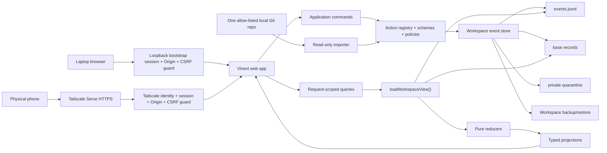

# Agency OS FULL MVP Architecture And Modules

Status: proposed implementation architecture
Prepared: 2026-07-29
Depends on: `01_PRODUCT_AND_UX_CONTRACT.md`
Current architecture: `../AGENCY_OS_ARCHITECTURE.md`

## 1. Architecture Decision

Keep the existing TypeScript/React/Vinext application and file-ledger model,
but separate four concerns that are currently mixed inside `app/ledger.ts`:

```text
domain truth
workspace persistence
application commands/queries
presentation
```

Do not introduce a database for FULL MVP. The local file workspace remains the
system of record because it is inspectable, portable and already matches the
product's artifact-first DNA.

## 2. Target System



Hard boundary:

> The web layer never imports mutable runtime projections or filesystem paths
> as module globals.

## 3. Runtime Modes

### PRIVATE

- normal dogfood mode;
- private workspace outside repository;
- writes allowed when every gate passes;
- physical-phone access allowed only through approved Tailscale Serve profile.

### DEMO

- synthetic workspace stored under repository fixtures or a temporary copy;
- persistent `DEMO` badge;
- resettable;
- never accepted as personal history.

Visible reset invokes `demo.reset`, a demo-only operational command. It verifies
mode before path resolution, recreates a temporary generation from one pinned
synthetic fixture version and can never resolve to PRIVATE data home. It is
unavailable in PRIVATE/UNAVAILABLE modes and has no migration/backup authority.

### UNAVAILABLE

- configured workspace missing, invalid, incompatible or locked beyond safe
  recovery;
- normal dashboard and writes are blocked;
- only diagnose, initialize, migrate, restore or choose workspace are allowed.

No implicit fallback from PRIVATE to DEMO. A missing private workspace must not
silently show convincing synthetic state.

## 4. Private Workspace Layout

Windows default:

```text
%LOCALAPPDATA%\AgencyOS\workspaces\<workspace-id>\
```

Override:

```text
AGENCY_OS_DATA_DIR=<absolute-workspace-root>
```

Layout:

```text
workspace.json
control.json
current.json
operation-journal.json
generations/
  <generation-id>/
    generation.json
    records/
      actors.json
      workspace-settings.json
      projects.json
      work-items.json
      claims.json
      evidence.json
      blockers.json
      decisions.json
      agent-runs.json
      approvals.json
      traces.json
    events/
      events.jsonl
    quarantine/
      index.jsonl
      payloads/
    sources/
      sources.json
      cursors.json
    indexes/
      current-state.json
locks/
backups/
operation-receipts/
```

`current.json` points to one stable-name generation directory. Its `records/`
is an immutable baseline snapshot; its event stream is mutable only through
append-only writes while that generation is active. Together they form a
self-contained workspace. Derived `indexes/` can be deleted and rebuilt.
Non-current generations are sealed read-only. A generation selected by restore
becomes the new current generation and may then receive append-only events; the
previous current generation is sealed.

Restore creates and validates a new generation, then atomically replaces the
small `current.json` pointer while holding the workspace lock. The prior
generation remains available for rollback. This avoids pretending Windows can
atomically replace a multi-file workspace.

FULL MVP does not copy attachment content. Evidence records contain
URL/path/commit/command-output metadata. Backup manifest therefore inventories
external references but cannot claim to back up the referenced external file.

## 5. Workspace Manifest

`workspace.json` minimum fields:

```text
formatVersion
workspaceId
displayName
createdAt
workspaceTimezone
mode
engineMinimumVersion
recordSchemaVersion
eventSchemaVersion
ownerActorId
phoneAccessProfile
```

Rules:

- workspace ID never comes from display name;
- timezone is explicit and defaults once during initialization;
- app refuses a newer incompatible format;
- checksum mismatch enters UNAVAILABLE;
- manifest updates use temp-file, flush and replace;
- private path is not stored in public project data.

Authority is intentionally not duplicated:

- `workspace.json`: stable identity, timezone, owner/access and compatibility;
- `current.json`: sole active-generation pointer;
- `control.json`: sole write-freeze/control state;
- active `generation.json`: sequence and event/base hashes;
- top-level operation receipts: backup/restore/migration timestamps.

`records/workspace-settings.json` is a versioned domain singleton, initialized
at version `0` with `activeProjectLimit: 5`. Owner-only
`workspace.settings_changed` mutates it through the event registry. A
project-create/activate command fails when it would exceed the limit; changing
the limit is a separate explicit command and event.

`control.json` is the authoritative operational control state:

```text
writeFrozen
freezeReason
changedAt
changedBy
minimumReadableGeneration
nextOperationNumber
```

Every writer, migration, backup and restore reads `control.json` while holding
the same exclusive workspace lock. Receipts audit control changes but do not
enforce them.

## 6. Bootstrap And Migration

### Empty initialization

1. Resolve default/explicit absolute path.
2. Reject any path inside the Git repository.
3. Create a temporary first generation.
4. Write one owner person record mapped from the authenticated initialization
   profile plus one workspace-settings record with `activeProjectLimit: 5`;
   every other baseline domain array starts empty.
5. Write empty event log, generation manifest, `control.json` and workspace
   manifest.
6. Validate and replay.
7. Flush files.
8. Rename temporary generation into place and publish `current.json`.
9. Write initialization receipt.

### Legacy migration

The current event log depends on repository baseline JSON. Migration must copy
both, not only the event log.

1. Load repository records plus legacy events.
2. Validate references and event hash chain.
3. Replay and record the expected final-state hash.
4. Create and verify the actual pre-migration backup artifact, then write its
   success receipt and retain the resulting backup ID.
5. Copy baseline records and event log to a temporary private generation that
   references the verified backup ID.
6. Validate and replay the target.
7. Compare final-state hash.
8. Atomically publish the target generation pointer.
9. Leave repository fixtures unchanged.
10. Record sanitized migration receipt outside the source bundle.

Rollback means selecting the previous workspace/backup. Migration never deletes
legacy source files.

Legacy compatibility manifest:

- enumerates every supported legacy record/event schema version;
- registers legacy informational actions explicitly, including replay-only
  `approval.used`;
- verifies the existing FNV-1a-32 chain without rewriting history;
- new events use a versioned SHA-256 chain over specified canonical UTF-8 bytes;
- a migration boundary record links the verified legacy terminal hash to the
  first new-chain hash;
- no silent rehashing or action-name inference is permitted;
- legacy `pending_scan` captures containing bodies are treated as untrusted,
  copied to quarantine through the new intake boundary and never projected
  normally before a successful rescan.

## 7. Module Boundaries

Proposed code layout:

```text
src/
  domain/
    model.ts
    schemas.ts
    actions/
      registry.ts
      capture.ts
      evidence.ts
      project.ts
      observation.ts
      review.ts
    policies/
      actors.ts
      approvals.ts
      evidence.ts
      freshness.ts
    reducers/
      replay.ts
      capture.ts
      evidence.ts
      project.ts
      observation.ts
  workspace/
    paths.ts
    manifest.ts
    loader.ts
    event-store.ts
    lock.ts
    migration.ts
    backup.ts
    restore.ts
    quarantine.ts
  application/
    commands/
    queries/
    projections/
  importers/
    local-git.ts
    source-registry.ts
  security/
    local-access.ts
    tailscale-identity.ts
    csrf.ts
    intake.ts
    redaction.ts
  ui/
    review-item.ts
    today-view.ts
    workspace-health.ts
```

Existing `app/` keeps route/page/component composition only.

Codex task-artifact parsing is not part of this core layout. A future approved
artifact contract may add it under a separately gated stretch module; the FULL
MVP build must not create an inactive core importer that looks supported.

### Import direction

```text
domain <- workspace <- application <- app
domain <- importers <- application
security <- application/app adapters
```

Forbidden:

- domain importing React, Next/Vinext or filesystem;
- workspace importing UI;
- route handlers importing repository fixture globals;
- projections writing files;
- importers calling command writers without producing a reviewed proposal.

## 8. Action Registry

One registry is the only way an event can affect state.

Registry entry:

```text
actionName
schemaVersion
entityType
inputSchema
eventPayloadSchema
actorPolicy
approvalPolicy
redactionPolicy
idempotencyPolicy
reducer
projectionTags
riskClass
```

Classification:

```text
registered state action -> validate and reduce
registered informational action -> validate and retain, no state mutation
unknown action -> reject
```

No regex or naming convention decides whether an action is state-changing.

## 9. Runtime Schema Decision

Use one schema definition for:

- command input;
- API parsing;
- event payload;
- imported proposal;
- fixture generation where practical.

Recommended dependency:

```text
zod 4
```

Reason:

- current domain uses TypeScript types plus repeated handwritten validation;
- the eleven new discriminated actions need runtime unions;
- Zod 4 supports discriminated unions and JSON Schema export;
- it prevents route, command and reducer validators from drifting.

Dependency rule:

- add only after a dependency-review slice;
- pin exact version in lockfile;
- no framework/schema migration in the same commit;
- retain semantic policy checks outside structural schemas.

If Zod is rejected, implement equivalent colocated parser functions and prove
schema parity with contract tests. Do not maintain three independent validators.

## 10. Command Pipeline

Every durable command:

```text
parse
-> authenticate actor
-> acquire/reload durable state
-> compare idempotency key + canonical intent
   -> exact existing intent: return exact_duplicate before approval revalidation
   -> changed intent: return idempotency_conflict
-> authorize action/scope for a genuinely new event
-> validate domain preconditions
-> build one event
-> preflight replay
-> reload/compare sequence while lock remains held
-> append + flush
-> replay/verify expected projection
-> return event ID, sequence and result class
```

Result classes:

```text
appended
exact_duplicate
validation_error
authorization_error
idempotency_conflict
workspace_unavailable
write_frozen
concurrency_conflict
internal_error
```

API routes translate result classes to stable HTTP responses. They do not expose
filesystem errors or raw payloads.

Canonical idempotent intent uses the same JCS implementation as event hashing.
The intent document includes:

```text
workspaceId
actorId
action
stable target/resource IDs
normalized user-supplied fields
expected entity/source versions
approvalId when the policy requires one
```

It excludes server timestamps, received-at time, generated entity/event UUIDs,
current sequence/hash, session/CSRF/confirmation-token randomness and other
transport metadata. `intentDigest` is SHA-256 over those canonical bytes. An
idempotency key maps permanently to one intent digest/result; rebuilding an
event after connection loss therefore does not change the intent.

Approval consumption follows the one-event rule. A new approval-gated command
puts `approvalId` and `expectedApprovalVersion` in its primary event. Preflight
requires the approval to be unused, unexpired, actor/scope/action matched and
single-use where declared. Applying that primary event marks the approval used
in the same pure transition. New commands do not append a second
`approval.used` event. Existing `approval.used` events remain supported only for
legacy replay/migration compatibility.

## 11. Cross-Entity Atomicity

FULL MVP uses one event as the atomic domain unit.

`capture.resolved` contains:

```text
captureId
outcome
typedTarget
sourceVersion
reviewedAt
```

The typed target is a discriminated union. Reducer applies capture transition
and target creation/update together in memory. Writer appends only after the
entire transition preflights successfully.

Target kinds:

```text
claim_created
evidence_submitted
blocker_created
blocker_resolved_by_decision
decision_recorded
project_next_action_set
work_item_created
work_item_completion_claimed
agent_run_proposed
correction_recorded
```

Every target includes:

```text
expectedSourceVersion
expectedEntityVersions{entityId: version}
resultingEntityIds[]
```

Entity-version semantics:

- every baseline entity starts at version `0`;
- an entity's version is the sequence of its last mutating event;
- every entity touched by one composite event receives that event sequence;
- new entity IDs are server-derived (`<type>-<crypto-random-uuid>`) and client
  supplied IDs for new records are ignored/rejected;
- preflight compares every entry in `expectedEntityVersions`;
- reversal compares every affected entity version, not only the primary target.

`blocker_resolved_by_decision` atomically creates a decision, links it to the
blocker, marks the blocker resolved and sets the replacement project next
action. Any failed precondition rejects the entire event.

Direct `project.created/state_changed -> blocked` is rejected. Only
`blocker_created` can establish blocked state because it atomically creates the
visible question and blocked next action.

`observation.reviewed` is also a discriminated union:

```text
observationId
reviewAction:
  adopted_as_claim | adopted_as_evidence | adopted_as_agent_run |
  linked | dismissed | evidence_requested | retry_source
expectedObservationVersion
reviewedAt
typedTarget
```

Allowed payloads depend on the ReviewItem kind:

- `adopted_as_claim` requires a human-authored assertion, subject and verifier
  policy and creates a proof-missing claim;
- `adopted_as_evidence` requires an existing claim/work-item subject and creates
  submitted, unverified evidence with observation provenance;
- `adopted_as_agent_run` requires human-entered objective, permission scope,
  result claim, declared external actions and the selected source actor;
- `linked` requires an existing compatible target entity and records provenance
  without claiming verification;
- `dismissed` requires a reason and creates no project-truth entity;
- `evidence_requested` creates a `ReviewItem` of kind `evidence_request`
  containing subject ID, required evidence types, requester, reason and status
  `open`; it is not evidence and cannot make anything green;
- `retry_source` is valid only for a source-health item. The review event records
  the request; the application then synchronously invokes `source.scan` and
  records the resulting health/observation events.

On `adopted_as_agent_run`, the reducer atomically upserts a constrained external
domain actor linked to the source-registry actor and creates the proposed
agent-run record. No imported author/message text can supply identity,
objective, scope or verification status.

`agent_run.reviewed` is a separate versioned action with outcomes
`accepted | rejected | evidence_requested`. Acceptance changes run review state
but never verifies its result claim or retroactively authorizes execution.
Imported runs derive
`authorizationStatus: approved | unapproved_historical | not_applicable` from
provenance plus a matching prior approval. Review cannot overwrite that status.
Evidence request creates the same typed `evidence_request` ReviewItem described
above.

`capture.review_marked classification=sensitive` is a registered nonterminal
transition. It atomically changes the capture review state to `quarantined`,
clears candidate type, removes it from normal Review projections and exposes
only masked metadata through Quarantine.

Evidence verifier policies are a closed enum:

```text
owner_review_allowed
independent_person_required
attestation_only
```

The claim stores the policy and required evidence types. Policy evaluation uses
submitter/reviewer actor IDs: an agent cannot review its own submission; the
owner may review externally inspectable artifacts under
`owner_review_allowed`; `independent_person_required` remains non-green without
a distinct eligible person; attestation satisfies only an explicitly required
attestation type and renders an attested, not independent, badge.

`review.checkpoint_recorded` requires `expectedSequence: N`. Under the writer
lock it conflicts if durable sequence is not N, then appends N+1 containing
`reviewedThrough: N`. The new baseline is N+1. Delta projections exclude
checkpoint events, legacy approval-consumption events and operational receipts,
but include user-visible observation/source-health events. Immediate revisit
after N+1 therefore returns zero.

No multi-event transaction is required for conversion. A
`capture.resolution_reverted` event supersedes the target and reopens the source
only when the target's current version still derives from the resolution event.
Otherwise reversal returns a conflict and requests an explicit correction.

Reversal is a registry-owned handler per target kind, not a generic delete:

| Target/outcome | Created entities | Existing entities touched | Compensation when every expected version still matches |
|---|---|---|---|
| `claim_created`, `decision_recorded`, `work_item_created` | typed entity | source capture | supersede created entity; reopen source |
| `evidence_submitted` | evidence | claim/work item | supersede evidence; recompute proof state from remaining evidence; reopen source |
| `blocker_created` | blocker | project state/next action | supersede blocker; restore prior project state/action stored in resolution; reopen source |
| `blocker_resolved_by_decision` | decision | blocker and project state/next action | supersede decision; restore prior blocker/project values stored in resolution; reopen source |
| `project_next_action_set` | none | project/next action | restore prior action snapshot; reopen source |
| `work_item_completion_claimed` | completion claim | work item | supersede claim; recompute work-item status; reopen source |
| `agent_run_proposed` | agent run and possibly external actor | source actor/observation | supersede run; restore or retire actor only from stored prior version; reopen source |
| `correction_recorded` | correction | corrected target | supersede correction and restore the recorded prior target version |
| `redacted` | provenance-linked capture | original capture | supersede redacted copy; reopen original into Quarantine |
| `dismissed`, `sensitive_retained` | none | source capture | reopen source into its prior Review/Quarantine state |

Each resolution payload stores the minimal prior values and versions required by
its row. If any affected entity changed later, compensation returns
`concurrency_conflict` and asks for a new explicit correction; it never performs
a partial reversal. The reversal command references the original resolution
event ID; server replay locates that persisted event and verifies its event hash
before reading prior values. Client-resubmitted prior snapshots are never
trusted.

## 12. Event Store Durability

### Canonical event bytes

New-chain event envelope:

```text
id
sequence
occurredAt
actorId
action
schemaVersion
payload
idempotencyKey
intentDigest
approvalId | null
previousEventHash
hashAlgorithm: sha256
canonicalizationVersion: rfc8785-jcs-v1
eventHash
```

Hash input is the complete envelope except `eventHash`, serialized with
RFC 8785 JSON Canonicalization Scheme:

- recursive lexicographic object-key ordering;
- JSON number/string/boolean/null representation defined by JCS;
- arrays retain order;
- no insignificant whitespace;
- UTF-8 bytes with no BOM and no trailing newline.

`eventHash` is `sha256:<64 lowercase hexadecimal characters>`.
`previousEventHash` is the previous full prefixed hash. The persisted JSONL line
is the canonical complete envelope including `eventHash`, followed by one LF.

The first new-chain event after legacy history is registered informational
action `system.hash_chain_migrated`:

```text
sequence: legacyTerminalSequence + 1
previousEventHash: legacy:fnv1a32:<8 lowercase hex>
payload:
  legacyAlgorithm: fnv1a32
  legacyTerminalSequence
  legacyTerminalHash
  newAlgorithm: sha256
  canonicalizationVersion: rfc8785-jcs-v1
```

Its `eventHash` uses the SHA-256/JCS rule above. Validator must verify the legacy
chain first, then this boundary, and never rewrite a legacy line.

Writer requirements:

- lock record contains PID, hostname, acquired time and random owner token;
- stale lock is not removed automatically merely because time elapsed;
- recovery checks whether owner process is alive and requires explicit command
  when uncertain;
- append uses one opened file handle;
- write complete line plus newline;
- call file-handle sync before success;
- update manifest/index only after event durability;
- crash before manifest update is recovered by replaying the event log.

Crash classification:

- valid complete hash chain exactly ahead of cached generation metadata:
  rebuild metadata/index from the event log;
- malformed or partial final line: enter UNAVAILABLE and require explicit
  recovery; never silently truncate;
- unexplained base/event hash divergence: enter UNAVAILABLE;
- cache/index mismatch with valid records/events: delete/rebuild cache only.

### Generic operational journal

Every receipt-producing operational command uses top-level
`operation-journal.json`:

```text
operationId
operationKind
resourceId
beforeHashOrVersion
intendedParametersHash
intendedAfterHashOrVersion | null
startSequence
phase: prepared | mutating | verifying | receipt_pending
startedAt
```

Under the exclusive lock, the allocator reads `control.nextOperationNumber`,
increments and fsyncs it before publishing the prepared journal. Gaps are
allowed; an operation number is never reused after a crash. The command updates
and fsyncs the journal around its mutation, verifies the resulting state, writes
and fsyncs the receipt, then clears the journal.

Startup classifies every pending operation:

- state equals `before` in prepared phase: safe abort receipt;
- state equals verified intended after-state: `recovered_success` receipt;
- operation-specific durable prefix exists: resume or explicit recovery;
- state matches neither known side: UNAVAILABLE.

This protocol covers initialization, migration, restore, backup,
`source.configure`, `source.scan`, freeze/unfreeze, owner/profile change and
Agency-OS-managed sensitive backup export. Quarantine reveal writes its receipt
before returning raw payload. Quarantine retain/redact/dismiss events include
the operation ID, allowing a missing audit receipt to be recovered from the
verified durable event.

Restore requirements:

- acquire the same exclusive workspace lock;
- validate source bundle and compatibility first;
- create safety backup;
- write target to a new generation path;
- flush;
- atomically replace the small `current.json` generation pointer;
- verify replay after replace;
- retain the prior generation for rollback.

The chosen Node/Windows pointer-replacement primitive must pass a
characterization suite on the target filesystem: replace-existing behavior,
open-handle and antivirus/indexer interference, failure before/after rename,
directory-handle flush where supported, and startup with both temp/current
pointers present. If reliable single-file replacement cannot be demonstrated,
implementation must use two checksummed pointer slots plus a checksummed
monotonic selector; startup selects the highest fully valid committed slot and
surfaces ambiguity as recovery, never by timestamp guess.

## 13. Request-Scoped Truth

One server request calls:

```text
loadWorkspaceView(workspaceContext)
```

The result includes:

```text
ledger
sequence
asOf
workspaceMode
validation
projectionStatus
```

Every page projection receives this result explicitly. Remove module-level
runtime exports such as precomputed projects, queues and recommendations.

PRIVATE mode must never fall back to bundled fixtures when filesystem loading
fails. The current `getRuntimeStateLedger()` fallback is replaced by an
explicit `UNAVAILABLE` result. Only DEMO mode may load repository fixtures.
`AGENCY_OS_DATA_DIR` must be absolute; relative runtime paths are rejected.

After a write:

- client navigates/revalidates;
- new request reloads workspace;
- every panel uses the same sequence;
- any failed required projection produces partial-state mode.

## 14. Intake And Quarantine

Intake structural checks:

- UTF-8;
- normalized line endings;
- configurable byte limit with conservative default;
- created/received timestamp bounds;
- source and project validity;
- SHA-256 idempotency digest over canonical non-secret metadata plus body;
- digest only, never raw body, enters logs/IDs.

Redaction scanner:

- deterministic local pattern and entropy checks;
- test corpus covers common API keys, tokens, private keys, credentials and
  false positives;
- scanner version recorded;
- safe result: `no_secrets_detected`;
- matched/uncertain result: private quarantine;
- scanner failure: quarantine and fail closed.

No scanner is advertised as proof that text contains no secret. The boundary
means suspicious/unknown content does not enter normal projections.

Quarantine:

- OS-user-protected private workspace;
- no encryption-at-rest claim in v0.4;
- payload separated from index metadata;
- normal loader reads only event-derived masked metadata;
- reveal uses no-store response and produces local audit receipt;
- screenshots/test output never include fixture secret values.

Quarantine persistence protocol:

1. Canonicalize and scan input in memory.
2. For a matched/uncertain/scanner-error body, write an immutable content-hash
   payload to a temporary file inside the active generation.
3. Flush and rename the payload into `quarantine/payloads/`.
4. Append and fsync a safe event containing only payload reference/hash, scanner
   version and masked metadata.
5. Rebuild `quarantine/index.jsonl` from events; it is a cache, not authority.
6. On startup, surface an unreferenced payload as an explicit orphan recovery
   item. Never silently delete or normally project it.

The payload publication and safe event append occur under the same workspace
lock. Failure after payload publication but before event append produces an
orphan, not a successful capture. A human-edited redaction passes the complete
intake/scanner again; matched, uncertain or scanner-failure results remain
quarantined and append no normalizing resolution event.

Reveal, retain, redact and dismiss require a recent owner-confirmation token.
The token is cryptographically random, single-use, expires after five minutes,
is bound to the authenticated owner session, exact identity, Host, CSRF token,
capture ID and intended action, and is never placed in a URL or log. The server
issues it only after a deliberate confirmation screen that contains masked
metadata rather than the raw payload. Consumption produces a sanitized audit
receipt. Reload, session rotation, freeze change or identity change invalidates
the token.

Token validation and consumption occur under the same workspace lock as the
resulting event. An exact idempotent retry may return the original result before
unused-token validation; two different concurrent intents cannot consume one
token.

## 15. Local And Physical-Phone Security

Default:

- application listens on `127.0.0.1`;
- direct LAN/public bind rejected;
- every private response requires an authenticated access profile;
- local browser writes require same-origin CSRF protection.

Recent owner confirmation is one generic server-side facility. Its token is
cryptographically random, single-use, expires after five minutes and is bound
to:

```text
session ID
authenticated identity
exact Host
CSRF generation
operation kind
resource ID/hash
canonical intended-parameters hash
nonce
```

It is required for quarantine reveal/retain/redact/dismiss,
`source.configure`, sensitive Agency-OS-managed backup export, unfreeze and
restore/migration commit. Tokens are never placed in URL/log/client storage.
Session/identity/Host/CSRF/freeze changes revoke them.

Desktop-local authentication:

1. Each process start generates a 256-bit ephemeral session secret and
   one-time bootstrap token.
2. Startup opens/prints a loopback bootstrap URL.
3. The bootstrap token is exchanged once for an HttpOnly, SameSite=Strict
   session cookie, then invalidated and removed from the URL.
4. The session expires after eight hours idle or process restart.
5. Missing/invalid session receives no private workspace data.

Physical phone:

- user-managed Tailscale on laptop and phone;
- Tailscale Serve proxies loopback over private tailnet HTTPS;
- Funnel is forbidden;
- the first valid identity-authenticated phone GET creates a server session
  bound to expected login, exact tailnet Host and access profile;
- phone session rotates on authentication/freeze changes, expires after eight
  hours idle and is revoked on logout, owner change or Serve-disable receipt;
- Agency OS still requires the exact configured `Tailscale-User-Login` on every
  private GET and mutation;
- missing, malformed, unexpected, shared-user or tagged-device/headerless
  identity is rejected before workspace loading;
- forwarded identity headers are trusted only when connection reaches the
  loopback listener through the configured Serve profile;
- Origin/Host allow-list and CSRF remain required;
- logout/revoke guidance includes disabling Serve and device access.

CSRF protocol:

- per-session cryptographically random synchronizer token;
- token stored server-side with the session;
- page receives token in same-origin rendered state, never URL/query/log;
- mutation sends `X-Agency-CSRF`;
- server verifies token with timing-safe comparison plus exact Origin/Host;
- token rotates on authentication and after privilege/freeze changes;
- duplicate tabs share the session but stale tokens receive an explicit
  reload-required result;
- local HTTP cookie omits `Secure` only on loopback;
- tailnet HTTPS cookie is `Secure`, HttpOnly, SameSite=Strict and path `/`.
- every PRIVATE HTML/API response sets `Cache-Control: private, no-store`;
- no service worker may cache PRIVATE responses;
- logout/Serve-disable tests prove browser back/reload/offline shows no cached
  workspace and stale CSRF requires a fresh session.

The current ChatGPT-header identity helper is not an authentication path for
PRIVATE mode and must be disabled/not imported by local/private routes.

This profile does not make Agency OS a public hosted application.

Threat-model boundary:

- Tailscale identity headers distinguish approved tailnet users only because the
  listener is loopback-only and the configured Serve proxy is the network
  ingress;
- CSRF protects browser requests, not arbitrary native processes;
- a malicious process already running as the same Windows OS user can reach the
  loopback listener and read that user's private files, so defending against a
  compromised same-user desktop process is explicitly outside v0.4;
- the release notes must state this limitation and must not describe forwarded
  headers as proof against a compromised local host.

Tailscale preflight receipt must prove:

- exact tested desktop daemon/client and phone client versions; until a manual
  preflight records them, `minimumTestedTailscaleVersion` is unset and the
  physical-phone release gate remains closed;
- laptop and untagged phone in intended tailnet;
- HTTPS enabled;
- exact expected owner login;
- access policy restricted to intended owner/devices;
- Serve proxies to `127.0.0.1:<port>`;
- Funnel disabled;
- wrong/headerless identity rejected;
- approved phone loads the private URL;
- Vinext accepts the forwarded tailnet Host without broadening the allow-list;
- identity headers reach only the tailnet guard and Secure/HttpOnly/Strict
  cookies persist correctly through Serve;
- every rejected GET/POST is denied before workspace loading.

Changing below/away from the recorded tested Tailscale profile requires the
manual preflight again. Synthetic header tests support implementation but cannot
create this receipt.

## 16. Read-Only Git Observation Importer

### Local Git

FULL MVP allow-lists exactly one repository root. Collect:

- repository ID/path hash;
- branch and HEAD;
- commit metadata since cursor;
- dirty/clean status;
- optional local verify receipt references.

`source.configure` is an owner-only operational command, not a hidden JSON edit:

- authenticated owner, Origin/CSRF and recent owner confirmation required;
- accepts register, replace or disable for the one-source limit;
- resolves absolute realpath and repository identity before mutation;
- compares expected source-registry version;
- acquires the workspace lock and atomically replaces `sources/sources.json`;
- register/replace creates a new stable source ID when repository identity
  changes; disable preserves observations and source history;
- writes a sanitized top-level receipt and returns a Settings/source-health
  projection;
- raw absolute path is displayed only to the owner in Settings and is masked in
  normal logs/errors.

Never:

- run hook code;
- checkout;
- fetch/pull/push;
- read arbitrary file content;
- infer verified completion from a commit alone.

The security claim is behavioral, not OS-enforced: the importer performs no
source writes. Production records before/after HEAD, ref snapshot, Git index
hash and porcelain status without reading worktree file contents. Hostile
fixture tests may independently hash fixture contents outside the importer to
prove nonmutation. The owner process may still have filesystem write
permission.

Execution boundary:

- resolve configured path with `realpath`;
- reject relative paths, symlink/junction/reparse-point escapes and a repository
  whose resolved identity changes unexpectedly;
- invoke `git` with argument arrays and `shell: false`;
- disable hooks, external diff/text-conversion helpers, credential helpers and
  optional locks;
- do not read repository file contents;
- cap initial import to 100 commits;
- cap stdout/stderr to 1 MiB;
- five-second subprocess timeout and forced termination;
- sanitize environment and never inherit tokens into recorded output;
- malformed/oversized/timed-out input creates a source-health item;
- every imported textual field, branch/author/message string and sanitized
  stderr passes through the same intake/redaction/quarantine boundary before
  observation, logs or safe summary;
- sanitize control characters, ANSI/terminal escapes and bidi controls before
  safe display; retain only quarantined/raw provenance when policy permits;
- cursor is `{repositoryId, lastObservedCommit, lastObservedAt, historyEpoch}`;
- force-push/non-ancestor history increments `historyEpoch` and requests human
  review rather than deleting prior observations.

Executable Git allow-list:

- resolve the Git executable once; invoke argument arrays with `shell: false`;
- allowed commands only:
  - `rev-parse --show-toplevel`;
  - `status --porcelain=v2 -z --branch --untracked-files=no`;
  - `log --no-decorate --no-show-signature --no-use-mailmap` with a bounded
    NUL-delimited format and at most 100 commits;
  - `merge-base --is-ancestor` for cursor ancestry;
- every invocation supplies an empty temporary hooks directory and disables
  fsmonitor, external diff/textconv, pagers, credential helpers and file
  protocol through explicit `-c` arguments;
- environment is constructed from an allow-list needed by the resolved
  executable/Windows runtime, plus `GIT_CONFIG_NOSYSTEM=1`,
  `GIT_CONFIG_GLOBAL=NUL`, `GIT_OPTIONAL_LOCKS=0`,
  `GIT_TERMINAL_PROMPT=0`, `GCM_INTERACTIVE=Never`, `GIT_PAGER=cat` and a fixed
  UTF-8 locale; arbitrary parent variables are not inherited;
- parser consumes bounded NUL-delimited bytes, not terminal-formatted lines.

Importer:

- derive the durable source cursor from imported observation events;
- treat `sources/cursors.json` as a rebuildable cache updated only after event
  fsync;
- allow exact-duplicate import to rebuild/advance the cache safely;
- produce `observation.imported`;
- dedupe by namespaced source ID + source revision;
- preserve source deletion/rename as health events;
- never mutate project truth until human `observation.reviewed`.

The durable cursor is therefore part of replayed observation state. The
rebuildable `cursors.json` cache is replaced only after the corresponding
`observation.imported` event is appended and fsynced. A crash before cache
replace merely triggers rebuild; a cache ahead of the durable event stream is
discarded and never advances the importer.

`source.scan` is a synchronous operational orchestrator, not a background job.
It loads the source/cursor, collects one bounded batch, then submits each
candidate through the ordinary atomic `observation.imported` command. A crash
may leave a durable prefix only; the next scan replays exact duplicates as
no-ops and continues from the last durable cursor. It never advances the cursor
past a failed item. Final scan result records complete/partial/failed counts and
creates a source-health ReviewItem when the batch is incomplete.

An exact duplicate `retry_source` review request does not suppress the scan
intent. It looks up the scan operation linked by the original review event:

- completed: return the prior scan result;
- partial or unreceipted: resume from the durable cursor;
- review event durable but scan never started: start it;
- currently running under another owner token: return `concurrency_conflict`
  with in-progress status.

A changed retry remains an idempotency conflict.

When an observation describes an agent-authored commit/run, the source registry
may contain an external actor record:

```text
sourceActorId
source
displayName
ownerActorId
status: active | retired
firstObservedAt
lastObservedAt
```

This maps provenance; it does not grant Agency OS write permission.

`observation.reviewed adopted_as_agent_run` opens a human-confirmed typed draft
for objective, permission scope, result claim and declared external actions.
On confirmation it atomically creates/updates a constrained external actor in
domain state linked to the source actor and creates the proposed run. Commit
author/message alone never supplies identity, objective or scope.

Codex task-artifact parsing is stretch scope. It requires a separately approved
versioned artifact contract and hostile-content parser before activation.

## 17. Backup And Restore Scope

Backup contains:

- manifest;
- one consistent sealed point-in-time backup snapshot of the active generation
  at an exact event cutoff;
- baseline records and event log through that cutoff;
- quarantine index and payload files as stored, with no encryption implication;
- sources/cursors;
- receipts required to interpret workspace;
- external evidence reference inventory;
- hashes and engine/schema compatibility.

Backup does not claim to contain external repositories or files referenced by
evidence.

Backup consistency protocol:

1. Acquire the exclusive workspace lock.
2. Allocate a monotonic operation ID and capture generation ID, event cutoff
   sequence/hash, source registry version and prior-receipt cutoff.
3. Copy the consistent snapshot to a temporary artifact; do not include the
   current operation's not-yet-existing receipt.
4. Canonicalize the manifest as sorted-key UTF-8 JSON with LF line endings,
   hash every inventoried file and fsync the artifact.
5. Atomically publish the artifact name.
6. Verify the published artifact, then write/fsync its top-level receipt.

A crash before artifact publication leaves disposable temp material. A crash
after publication but before receipt creates an explicit orphan backup:
recovery verifies it and asks the owner to finalize it with a
`recovered_success` receipt or delete it. It is not listed as an ordinary valid
backup until finalized.

Backup manifest and confirmation UI state:

```text
containsQuarantinePayloads: true | false
encryptionClaim: none
externalEvidenceContentIncluded: false
```

Copying a bundle that contains quarantine payloads outside the workspace
through an Agency-OS-managed export requires deliberate recent owner
confirmation and warns that Windows workspace ACL protection may not follow the
copy. Every bundle carries the manifest flags even when copied by other means.
Agency OS cannot detect or prevent Windows Explorer or another process from
copying the file and makes no unmanaged-copy enforcement claim.

Restore:

1. acquires the exclusive workspace lock and confirms writes are frozen;
2. validates bundle into a new generation directory;
3. replays and compares manifest/state hashes;
4. flushes every generated file;
5. atomically replaces only `current.json`;
6. keeps the prior generation and safety backup;
7. reloads the new generation before reporting success.

If pointer replacement fails, the old pointer remains authoritative. No
independent in-place replacement of events, quarantine and sources is allowed.

Operation receipts live outside the bundle they describe to avoid circular
state. A post-success receipt can later be displayed/imported into History.

Receipt policy for v0.4:

- SHA-256 checksum for corruption detection;
- no digital-signature or tamper-proof claim;
- monotonically ordered operation ID plus timestamp;
- operation kind, source/target generation, manifest hashes, outcome and app
  version;
- backup receipts include the exact source generation, event cutoff sequence
  and content hash; restore receipts include the backup ID, prior pointer and
  new pointer;
- retained with workspace operation history and included in later backups
  only as historical receipts whose operation IDs precede that backup's cutoff;
- clean-machine verification needs no secret signing key.

Receipt publication is part of operation completion, not part of the generation
bundle. Under the workspace lock, the operation allocates its ID, completes and
fsyncs the generation/pointer change, verifies the result, then writes and
fsyncs the top-level receipt. The API reports success only after the receipt is
durable. If the process crashes after pointer publication but before receipt
publication, startup recovery detects the unreceipted pointer transition,
verifies both generations, and requires an explicit recovery choice that writes
a `recovered_success` or `recovered_rollback` receipt. It never invents an
ordinary success receipt silently.

## 18. UI Projection Modules

Required projections:

- workspace health;
- Today delta by checkpoint sequence;
- project portfolio health;
- one next action per active project;
- unified ReviewItem queue;
- evidence/claim status;
- blocker/decision state;
- agent observation review;
- source health;
- history/event provenance.

Projection contract:

- pure functions over one loaded ledger/workspace view;
- deterministic ordering;
- literal counts;
- explicit unavailable/partial result;
- no hard-coded live copy;
- no filesystem or network access.

## 19. Dependency Policy

### Keep

- TypeScript/React;
- current Vinext/Next route/page surface during FULL MVP;
- Node built-ins for filesystem, path, crypto and process checks;
- existing node:test suites.

### Add deliberately

- `zod@4.4.3` for runtime structural schemas;
- `@playwright/test@1.62.0` for browser journeys;
- `@axe-core/playwright@4.12.1` for automated accessibility checks.

These are registry versions observed on 2026-07-29, not standing "latest"
ranges. A dedicated dependency-preflight slice must review license/advisories,
install exact versions without unrelated upgrades, inspect lockfile diff,
install the Playwright-version-pinned Chromium and WebKit binaries, run one-page
smokes in both and record whether browser installation works in the unattended
host. If any step fails, dependent browser tasks remain blocked rather than
changing framework or package strategy.

### Operational dependency

- Tailscale Serve for the approved physical-phone profile.

### Do not activate

- Drizzle/D1 as runtime source of truth;
- Cloudflare production deployment;
- hosted auth;
- background job system;
- queue/database/cache infrastructure.

### Remove or replace during hardening only if isolated

- `next/font/google`: Vinext reports partial support and loads fonts from CDN;
  use system/local fonts for private/offline behavior.
- unused runtime dependencies may be removed in a dedicated dependency slice
  after `npm ls` and build evidence.

Vinext remains acceptable for local MVP because current compatibility check is
94% with only the font path partial. It remains a production risk and advanced
Next/Vinext APIs are avoided.

Before private-session implementation, characterization tests must prove Vinext
cookie persistence, forwarded Host handling, no-store headers and the
loopback-bootstrap wrapper. Replacing `next/font/google` with the existing
system/local typography is an isolated hardening slice. The unresolved
Next/PostCSS/sharp production audit keeps production release closed and is not
force-fixed during FULL MVP work.

## 20. Test Architecture

### Unit/domain

- schemas;
- policies;
- reducers;
- projections;
- ordering/freshness;
- secret-safe errors.

### Workspace integration

- path rejection;
- initialization/migration;
- append/lock/stale-lock recovery;
- restore concurrency;
- clean repository invariant;
- importer cursor/idempotency.

### Command/API

- every result class;
- actor/approval/CSRF/identity negative cases;
- exact duplicate versus changed conflict;
- no raw data in errors.

### Browser E2E

Use Playwright Test:

- desktop Chromium;
- mobile Chrome emulation;
- mobile Safari emulation;
- named viewport matrix;
- real Tailscale physical-phone smoke remains a manual gate;
- deterministic private temp workspace per test;
- axe scan plus keyboard/focus/reflow/manual checklist.

Rendered-string tests remain cheap smoke tests but do not prove journeys.

## 21. Migration From Current Files

Refactor order:

1. Add module characterization tests around current behavior.
2. Introduce workspace path/manifest without changing current commands.
3. Move runtime loading behind adapter.
4. Move types/schemas/policies.
5. Move replay and projections.
6. Move writer/lock.
7. Update routes/pages to request-scoped view.
8. Delete compatibility exports only after no consumer remains.

Do not rewrite the 1,577-line ledger module in one commit. Use strangler-style
extraction with parity tests.

## 22. Architecture Invariants

1. Public repository never owns private runtime data.
2. One request uses one sequence and one projection set.
3. Only registered actions reduce state.
4. One durable command appends one atomic event.
5. Importers propose; humans adopt.
6. Sensitive/unknown text stays out of normal projections.
7. Active project always has one next physical action.
8. Evidence submission and verification are separate.
9. Operations fail closed before destructive mutation.
10. Every backup states exactly what it does and does not contain.
11. Every visible action has a command and policy.
12. Demo never masquerades as private current truth.
