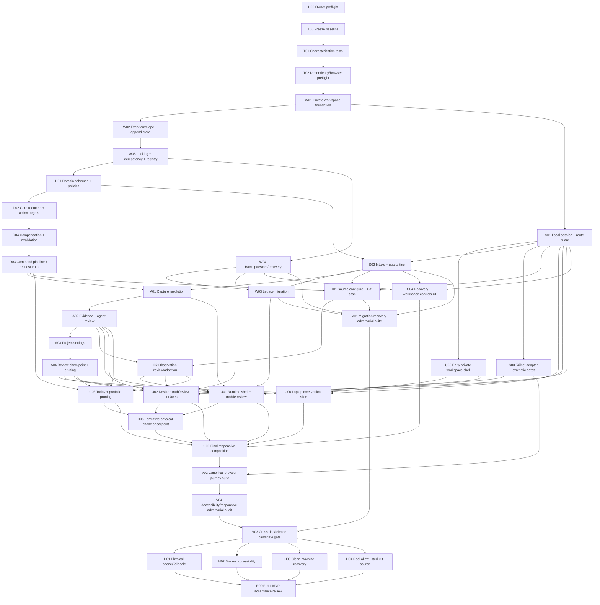

# Agency OS FULL MVP Implementation DAG

Status: proposed execution graph
Prepared: 2026-07-29
Depends on:

- `01_PRODUCT_AND_UX_CONTRACT.md`;
- `02_ARCHITECTURE_AND_MODULES.md`.

## 1. Honest Execution Target

The autonomous target is:

```text
FULL MVP implementation candidate
```

It means every automated contract, migration fixture, security-negative test,
browser journey and consistency gate passes on an integration branch.

It does not mean:

```text
FULL MVP accepted for private daily use
```

Final acceptance also requires owner-controlled physical-device, assistive
technology and clean-machine checks. An unattended agent cannot install/sign in
the owner's phone, judge NVDA/VoiceOver output or approve real-data migration.
The coordinator must report those gates as `MANUAL_PENDING`, never as passed.

Planning estimates in `TASK_GRAPH.json` total 3,395 automated task-minutes. The
automated dependency path to V03 is 1,920 minutes; the end-to-end path including
H05 is 1,940 minutes. The currently
declared safe-parallelism constraint raises the automated execution lower bound
to 3,155 minutes (52.6 hours) before review, merge, verification, repair and
owner-gate overhead. `scripts/analyze-full-mvp-schedule.mjs` validates these
figures and the corresponding minimum of eight 450-minute productive windows.
Estimated review and coordination create an eleven-window operating budget;
11-13 is the practical planning range before repair and owner scheduling.
These are planning bounds, not promises. A single eight-hour window should be
expected to produce accepted baseline/workspace waves, not U00 or the entire
candidate. U05 may be dispatched in that first window only when at least
ninety minutes plus review/repair reserve remain; it is not a required
eight-hour outcome. The same stable goal resumes across multiple
owner-authorized windows; every window gets its own authorization and deadline.

## 2. Execution Roles

### Coordinator

- owns the integration branch and task graph;
- dispatches only dependency-ready tasks;
- assigns file ownership before work starts;
- reviews worker evidence and merges locally;
- runs the aggregate gate after every merge wave;
- never pushes `main`, deploys or migrates real data without owner authority;
- stops rather than inventing a product/security choice.

### Worker

- uses one task branch/worktree;
- implements one task ID only;
- does not move `main` or the integration branch;
- adds focused tests and an evidence artifact;
- commits only after the task-local gate passes;
- stops for coordinator review.

### Independent reviewer

- does not edit;
- scores the completed wave against its contract and deterministic gates;
- cannot waive a failed test or manual gate;
- returns concrete findings within the wave scope;
- accepts only at 92/100 or higher with no blocker.

### Owner

- completes the human preflight;
- approves dependency/security/product choices marked `OWNER_REQUIRED`;
- performs physical phone, assistive technology, real-repository and
  clean-machine acceptance;
- decides merge/push/deploy after the candidate is reviewed.

## 3. Git And Worktree Model

On initial goal initialization, the coordinator creates the integration branch
exactly from the externally authorized start commit. The accepted planning
commit must be an ancestor of that start commit:

```text
integration/full-mvp-v0.4
```

Before any implementation worker, it also creates a detached, clean authority
worktree pinned exactly to the accepted planning commit:

```text
C:\Agency_os_first\worktrees\full-mvp-authority-<goal-id>
```

No worker or V03 task may edit it. All execution/evidence/manual/release
validators are invoked from this authority worktree with the candidate root
passed explicitly.

It checks that branch out only in:

```text
C:\Agency_os_first\worktrees\full-mvp-controller-<goal-id>
```

The canonical checkout remains clean on its existing branch. Controller state,
task merges and aggregate verification occur in the controller worktree.
Later windows reuse that exact controller worktree and validated `RUN_STATE`.
Its clean integration HEAD may have evolved beyond `authorizedStartCommit`; it
must descend from that commit and contain every task merge recorded as
`merged`. It is never required to equal `planningCommit` or reset to
`authorizedStartCommit`. The authority worktree remains detached, clean and
exactly pinned to `planningCommit`.

Each task uses:

```text
task/<task-id>-<short-name>
C:\Agency_os_first\worktrees\<task-id>-<short-name>
```

Rules:

- `main` remains untouched;
- task branches start from the current integration head unless the graph
  explicitly marks safe parallelism;
- workers never merge;
- coordinator uses no-ff merge commits so task boundaries remain visible;
- merge order follows this graph, not completion time;
- a failed aggregate gate rolls back the candidate merge commit, not user work;
- no force-push, deploy or real-data migration.

## 4. Global Task Exit Contract

Every automated task must leave:

```text
tasks/full-mvp/<task-id>/
  PLAN_FIRST.md
  RESULT.md
  reviews/
    <role>-round-<n>.json
  IMPLEMENTATION_RECEIPT.json
  COORDINATOR_ACCEPTANCE.json
  COORDINATOR_REJECTION.json (only after a failed post-merge aggregate)
```

`PLAN_FIRST.md` contains:

- goal;
- dependencies and starting commit;
- in scope;
- out of scope;
- files/modules owned;
- done criteria;
- evidence commands.

`RESULT.md` contains:

- changed files;
- behavioral result;
- exact commands/results;
- known gaps;
- starting commit and pre-commit Git tree hash;
- no-claim statement for any manual gate.

Worker commits only `PLAN_FIRST.md`, implementation/tests and `RESULT.md`.
It cannot place its own commit SHA inside that commit.

After the worker commit, coordinator writes `IMPLEMENTATION_RECEIPT.json` with:

- worker commit SHA;
- starting SHA;
- result tree hash;
- worker/task/worktree identifiers;
- exact focused acceptance commands with exit codes and start/end times;
- focused verification evidence paths.

Each independent reviewer gets a separate file under `reviews/` containing:

- reviewer identity/role;
- score;
- deterministic gate results;
- findings and disposition;
- ACCEPT/REJECT.

After all required independent reviews accept, the coordinator merges the task
locally, runs the aggregate gate on the merged integration commit and only then
writes `COORDINATOR_ACCEPTANCE.json`. If the aggregate gate fails, the
coordinator reverts the attempted merge and writes `COORDINATOR_REJECTION.json`;
it must never author an acceptance first and invalidate it later. Reviewers
never edit the worker branch, workers never author their review artifact, and
worker, coordinator and reviewer identities must all be distinct.

Task completion requires:

1. declared scope only;
2. focused tests pass;
3. `git diff --check` passes;
4. no unexpected tracked/untracked files;
5. reviewer score at least 92 with no blocker;
6. coordinator aggregate gate after merge.

## 5. Dependency Graph



## 6. Journey And Acceptance Traceability

`TASK_GRAPH.json` is the machine authority for dependencies and ownership.
This table is its human-readable projection:

| Journey | Acceptance fixtures | Owning tasks | Level / required command family | Required evidence artifact |
|---|---|---|---|---|
| J-01 workspace | AT-J01, AT-J01-M | W01, W03, H05, U01, U06, V01, V02, V04 | workspace/API + Playwright onboarding/migration | `tasks/full-mvp/evidence/AT-J01*.json` |
| J-02 phone capture | AT-J02, AT-J02-X, AT-J02-N | S01, S02, A01, H05, U00, U01, U06, V02, V04, H01 | command/API + Chromium/WebKit + physical phone | `AT-J02*.json`, `manual/H01-physical-phone.json` |
| J-03 review/conversion | AT-J03, AT-J03-R | D02, D04, A01, H05, U00, U01, U06, V02, V04, H01 | reducer/command + browser + physical timing | `AT-J03*.json`, H01 |
| J-04 evidence | AT-J04 | D02, A02, U00, U01, U02, U06, V02, V04, H01 | policy/reducer/API + browser + physical phone | `AT-J04.json`, H01 |
| J-05 blocker/decision | AT-J05 | D02, A03, U00, U01, U02, U06, V02, V04, H01 | atomic reducer/API + browser + physical phone | `AT-J05.json`, H01 |
| J-06 agent run | AT-J06 | D02, A02, I02, U01, U02, U06, V02, V04, H01 | seeded run review then Git-observation adoption/browser/phone | `AT-J06.json`, H01 |
| J-07 Today | AT-J07 | D02, A04, U00, U01, U03, U06, V02, V04, H01 | sequence/domain + browser + physical timing | `AT-J07.json`, H01 |
| J-08 recovery | AT-J08 | W04, U04, U06, V01, V02, V04, H03 | fault/API + browser controls + clean recovery | `AT-J08.json`, `manual/H03-clean-recovery.json` |
| J-09 desktop return | AT-J09 | D03, U02, U03, U06, V02, V04 | request projection + Chromium navigation | `AT-J09.json` |
| J-10 pruning | AT-J10, AT-J10-B | D02, D04, A03, A04, U03, U06, V02, V04 | policy/command + browser weekly review | `AT-J10*.json` |
| J-11 Git continuity | AT-J11, AT-J11-D, AT-J11-X | I01, I02, U02, U03, U06, V01, V02, V04, H04 | hostile fixture/command + browser source health + real allow-listed non-mutation gate | `AT-J11*.json`, H04 |
| J-12 quarantine | AT-J12 | S02, A01, U01, U06, V02, V04, H01 | security-negative/reducer + browser + physical phone | `AT-J12.json`, H01 |
| cross-surface | AT-ZERO, AT-PARTIAL | D03, U00, U01, U02, U03, U06, V02, V04 | projection + Chromium/WebKit failure states | `AT-ZERO.json`, `AT-PARTIAL.json` |

Required command families become exact paths when their owning task writes
PLAN FIRST:

```text
node --test tests/full-mvp/<domain-or-workspace-suite>.test.mjs
npx playwright test tests/e2e/<journey>.spec.ts --project=<engine>
npm run verify
```

Plan validation fails if any J-01 through J-12 or any fixture in the accepted
product contract is absent from `TASK_GRAPH.json`. V03 fails if the mapped
artifact is absent, non-PASS, produced by the wrong level/engine, or falsely
substitutes emulation for a manual gate.

## 7. Human Preflight

### H00 — Required before unattended implementation

Owner confirms:

- canonical repo and approved planning commit;
- adequate disk space for worktrees, npm packages and Playwright browser;
- no uncommitted user work in canonical repo;
- no real private data will be migrated during the run;
- Tailscale installation/configuration may be implemented synthetically but
  physical acceptance is deferred;
- no push, deploy or production-risk acceptance;
- coordinator may create/delete only task worktrees it created;
- stop/notification behavior is understood.

Authorization artifact lives outside Git:

```text
%LOCALAPPDATA%\AgencyOS\run-authorizations\<goal-id>\<window-id>.json
```

It contains immutable stable goal ID, unique authorization/window IDs, planning
commit, authorized start commit, time window and permissions.
`authorizedStartCommit` may equal planning commit or be a clean descendant
explicitly named by the owner; the coordinator proves ancestry. It hashes the
external authorization and records only a sanitized receipt under the
integration task tree. This avoids both a dirty canonical worktree and a
self-referential commit.
It must validate against `EXECUTION_SCHEMAS.json#/$defs/OwnerAuthorization`.
Without H00, the autonomous coordinator may audit/plan but must not implement.

## 8. Wave 0 — Baseline And Characterization

### T00 — Freeze baseline

Goal: prove the exact starting point.

Deliver:

- Git status/head/origin evidence;
- Node/npm/dependency inventory;
- current file/module metrics;
- a baseline worktree bootstrap receipt proving that a freshly created task
  worktree can run
  `npm ci --prefer-offline --no-audit` against the committed lockfile and then
  execute its focused gate; this protocol applies immediately to T01 and does
  not wait for T02;
- `npm run verify`, trusted production-audit classification and Vinext check
  results;
- public/private-data leak scan;
- immutable baseline receipt.

No code behavior change.

### T01 — Characterize current behavior

Goal: protect the strangler refactor from accidental semantic loss.

Add tests for:

- current event replay and every legacy action;
- exact duplicate versus changed retry;
- approval legacy behavior;
- current API result classes;
- current rendered counts, including literal zero;
- current backup/restore behavior;
- fixture/public-tree unchanged checks.

Done: tests fail if an existing supported behavior is removed before its
replacement exists.

### T02 — Dependency and browser preflight

Goal: make future automated tasks reproducible.

Deliver:

- exact reviewed Zod/Playwright/axe versions from Architecture section 19;
- isolated lockfile diff;
- Playwright Chromium and WebKit installation receipts and one-page smokes;
- `WORKTREE_DEPENDENCY_PROTOCOL.md` specifying per-worktree `npm ci` against the
  shared npm cache, shared version-pinned Playwright browser path, lockfile
  equality check, measured disk use/quota and cleanup after accepted merge;
- Vinext cookie/Host/no-store/bootstrap characterization;
- isolated replacement of `next/font/google` with system/local fonts;
- unchanged production-release blocker for unresolved Next audit.

Stop if installation needs broad dependency/framework changes.

T02 may extend the T00 baseline protocol only for the exact accepted dependency
and browser additions. T01 and every earlier worktree use the T00 bootstrap
receipt; missing `node_modules` is never a reason to skip verification.

Wave gate:

```text
npm run verify
node <authority-root>/scripts/classify-production-audit.mjs
npx --no-install vinext check
Playwright Chromium and WebKit one-page smokes
```

`BLOCKED_KNOWN_UPSTREAM` is a passing classification gate only for continuing
private local development. It is not a security-clear result and still blocks
production release. Any audit drift is a failing wave gate.

## 9. Wave 1 — Workspace And Durability

### W01 — Private workspace foundation

Owns:

- `src/workspace/paths.ts`;
- workspace/current/control/generation manifests;
- PRIVATE/DEMO/UNAVAILABLE loader;
- empty initialization;
- test fixtures outside Git.

Required tests:

- default `%LOCALAPPDATA%` path;
- absolute override only;
- reject repo-contained path and reparse escape;
- owner/settings baseline;
- no PRIVATE-to-DEMO fallback;
- clean Git tree after normal write.

### W02 — Versioned event envelope and append store

Owns:

- event envelope and SHA-256 canonical chain;
- entity-version rules;
- legacy action/hash adapter;
- request-safe result classes.

Required tests:

- legacy FNV replay without rewrite;
- migration-boundary chain;
- unknown action rejection;
- append/crash result classification.

### W05 — Event store locking, idempotency and action registry

Owns:

- action registry;
- exclusive lock and exact-retry ordering;
- lock metadata, stale-lock recovery and bounded conflict results.

Required tests:

- concurrent sequence conflict;
- lock-owner/stale-lock recovery;
- exact retry succeeds after approval was consumed;
- changed retry conflicts;
- crash classifications.

### W03 — Legacy migration

Depends on both S02 intake/quarantine and W04 backup/recovery so the task
cannot dispatch until the verified pre-migration backup implementation exists.

Owns:

- compatibility manifest;
- dry-run and explicit confirm;
- verified pre-migration backup;
- legacy `pending_scan` quarantine path;
- no source deletion/rehash;
- rollback selection.

Uses only synthetic copies. Real owner data is excluded.

### W04 — Backup, restore and recovery

Owns:

- sealed cutoff snapshot;
- canonical inventory/checksums;
- operation receipts;
- orphan artifact and unreceipted pointer recovery;
- exclusive restore lock;
- generation pointer swap and rollback;
- plaintext/quarantine disclosure.

Required tests include process-kill/fault injection at every documented commit
point.

Wave gate:

- clean-repository invariant;
- deterministic replay hash;
- migration/restore fault suite;
- independent architecture reviewer 92+.

## 10. Wave 2 — Domain And Request Truth

### D01 — Domain schemas and policies

Owns:

- model/entity types;
- Zod structural schemas;
- actor, approval, verifier, freshness and active-project policies;
- workspace-settings record;
- ReviewItem union.

No filesystem, HTTP or React imports.

### D02 — Core reducers and action targets

Owns:

- replay dispatcher;
- existing and eleven new actions;
- entity version updates;
- atomic capture/observation targets;

Required table tests cover every core action and target kind.

### D04 — Compensation, reversal and invalidation reducers

Owns:

- target-specific reversal handlers;
- claim/evidence and blocker/decision state machines.

Required property/table tests cover every reversal row, invalidation edge and
replay-after-compensation state.

### D03 — Command pipeline and request truth

Owns:

- parse/auth/idempotency/approval/preflight/lock/append pipeline;
- stable application result union;
- `loadWorkspaceView()`;
- request-scoped projections;
- removal of PRIVATE fixture fallback and module-global mutable projections.

Required tests:

- one request/one sequence;
- write/reload parity;
- partial projection blocks green;
- literal zero count;
- no raw filesystem/intake values in errors.

Wave gate:

- module import-boundary test;
- old public API characterized or replaced;
- no 1,577-line rewrite commit;
- independent domain reviewer 92+.

## 11. Wave 3 — Security Boundaries

### S01 — Local session and route guard

Owns:

- one-time loopback bootstrap;
- server session store;
- Origin/Host and CSRF;
- no-store headers;
- route body/time/rate bounds;
- desktop-local denial before workspace load.

### S02 — Intake and quarantine

Owns:

- structural intake;
- deterministic local scanner and corpus;
- content-hash payload publication;
- event-derived quarantine index;
- orphan recovery;
- owner-confirmation token;
- rescan-before-redacted-copy.

Secret-shaped fixture values must never enter snapshots, logs or test output.

### S03 — Tailnet adapter synthetic gates

Owns:

- exact identity/header adapter;
- expected Host profile;
- Secure/Strict cookie behavior under synthetic proxy tests;
- Funnel/public/LAN rejection;
- logout/freeze/Serve-disable session rotation;
- documented same-OS-user threat boundary.

S03 cannot pass H01; it may only make the implementation ready for H01.

Wave gate:

- security-negative test matrix;
- request denied before workspace load;
- cache/back/offline test;
- independent security reviewer 92+.

## 12. Wave 4 — Core Product Actions

### A01 — Capture resolution

Implements:

- sensitive review transition;
- typed `capture.resolved`;
- safe redaction copy;
- `capture.resolution_reverted`;
- all target-specific conflict behavior.

### A02 — Evidence and agent review

Implements:

- `evidence.submitted`;
- `evidence.reviewed`;
- verifier policy/badges;
- `agent_run.reviewed`;
- evidence-request ReviewItems;
- truthful claim state derivation.

### A03 — Project and settings commands

Implements:

- `project.created`;
- `project.state_changed`;
- `workspace.settings_changed`;
- active-project limit;

### A04 — Review checkpoint and portfolio pruning commands

Implements:

- blocker/decision atomic paths;
- `review.checkpoint_recorded`;
- Today delta eligibility/concurrency.

Wave gate:

- AT-J03, AT-J03-R, AT-J04, AT-J05, AT-J07 and seeded-run
  `agent_run.reviewed` domain/API fixtures;
- exact retry and stale-version cases;
- independent product-DNA reviewer 92+.

## 13. Wave 5 — Observation Continuity

### I01 — Source configuration and Git scan

Implements:

- owner-only `source.configure`;
- one-repository source registry;
- executable Git command/environment allow-list;
- safe bounded parser;
- observation events and durable cursor;
- source-health and partial-scan recovery;
- before/after repository hash proof.

### I02 — Observation review and adoption

Implements:

- claim/evidence/agent-run adoption;
- link/dismiss/evidence-request/retry;
- constrained external actor mapping;
- no automatic verification;
- imported-text quarantine.

Wave gate:

- full AT-J06 plus AT-J11, AT-J11-D and AT-J11-X;
- hostile repository fixture suite;
- source tree/index/ref hashes unchanged;
- independent importer/security reviewer 92+.

## 14. Wave 6 — Product Surfaces

### U05 — Early private workspace shell

Produces visible product value within the first authorized window without
pretending that the full domain loop already exists:

```text
PRIVATE / DEMO / UNAVAILABLE truth
-> initialize and reopen a synthetic private workspace generation
-> see workspace identity, health and recovery location
-> see unavailable capture/review actions honestly disabled with the next
   dependency named
```

It reuses only accepted baseline/session/workspace contracts. It has no release
AT fixture and must not fake capture, quarantine, typed conversion, evidence,
blockers, Today or agent review. Its smoke artifact proves only early visible
workspace truth. U00 later replaces this constrained shell with the full laptop
core loop.

### U00 — Laptop core vertical slice

Implements the first useful private laptop loop immediately after core actions:

```text
Capture -> Review -> typed truth/evidence -> Today -> next action
```

It uses a newly initialized synthetic/private-temp workspace and deliberately
excludes migration controls, tailnet states, Git adoption and final responsive
polish. It must prove visible product value before later infrastructure can
consume the remaining unattended window.

### U01 — Runtime shell, mobile review and formative composition

Implements:

- PRIVATE/DEMO/UNAVAILABLE shell;
- workspace initialization/migration surfaces;
- phone capture, Review and Quarantine;
- offline/unknown-submit/exact-retry states;
- focus/live-region behavior;
- a provisional integrated `app/page.tsx`/layout seam that exposes U02 desktop
  truth and U03 Today through explicit navigation without appending the full
  desktop dashboard below the phone surface.

U01 depends on U00, U02 and U03 so H05 always tests one integrated product
commit, not disconnected laptop/mobile/desktop/Today surfaces. U06 later owns final
cross-breakpoint polish; it does not create H05's navigation seam retroactively.

### U02 — Desktop truth and review surfaces

Implements:

- project/work/claim/evidence/blocker/decision/run truth;
- unified Review queue;
- provenance/history drill-down;
- source/settings/health;
- policy-eligible controls only.

### U03 — Today and portfolio pruning

Implements:

- sequence delta;
- one recommended physical action;
- literal counts and deterministic order;
- checkpoint completion;
- active-limit weekly keep/pause/archive loop.

### U04 — Recovery and workspace controls

Implements the required J-08 surface:

- create backup and show exact manifest disclosure;
- restore dry-run;
- recent-owner confirmation and guarded restore;
- operation/recovery receipts;
- freeze and owner-confirmed unfreeze;
- orphan/unavailable recovery guidance.

### H05 — Formative physical-phone checkpoint

This is a short owner/UX checkpoint after the first working mobile review,
desktop truth and Today surfaces (U01-U03), but before final composition U06.
It is deliberately manual and may pause the multi-window goal.

Required proof on the owner's real phone:

- capture/review intent is visible without hunting below desktop-first panels;
- soft keyboard does not cover the primary action or success/error feedback;
- primary touch targets are at least 44 px and usable one-handed;
- browser back, reload and resume do not lose the in-progress intent;
- no horizontal overflow;
- the phone layout does not append the full desktop dashboard below the mobile
  surface; desktop truth remains reachable through explicit navigation.

The artifact is `tasks/full-mvp/manual/H05-formative-phone.json` with owner and
independent UX attestations. It records those two desktop/phone assertions
separately and binds a first-screen screenshot plus an explicit-navigation
screenshot through `evidencePaths`. A failing result creates a bounded UI
repair before U06; it may not be waived by an automated reviewer score.

### U06 — Final responsive surface composition

Goal: make the independently built surfaces behave like one Agency OS rather
than a collection of locally correct panels.

Owns:

- final `app/page.tsx`, layout and global responsive composition;
- phone-first first-screen priority and desktop information hierarchy;
- 390/760/1024/1280/1440 reflow; the phone surface never appends the desktop
  dashboard below-fold, and desktop truth is reached through an explicit
  navigation affordance;
- 44 px minimum touch targets, soft-keyboard-safe capture/review, back/resume
  behavior, stable focus after success/error and no horizontal overflow;
- zero/partial/error-state composition across all implemented surfaces.

No new domain action or conversion behavior belongs in U06. Done means the
Chromium and WebKit composition journey passes against the already implemented
surfaces, with a committed responsive surface matrix and trace.

Wave gate:

- rendered contract tests;
- Playwright desktop/mobile matrix;
- zero/empty/loading/conflict/partial modes;
- axe automated scan;
- independent UX reviewer 92+.

## 15. Wave 7 — Candidate Verification

### V01 — Migration and recovery adversarial suite

- corrupt/incompatible/partial event cases;
- crash at quarantine/append/backup/restore commit points;
- old pointer preservation;
- orphan recovery;
- clean temporary-machine simulation;
- public repository unchanged.
- full bundle includes and restores quarantine plus source registry/cursor state;
- Git/source observations survive recovery at the exact cutoff.

### V02 — Canonical browser journey suite

- 390, 760, 1024, 1280 and 1440 widths;
- desktop Chromium, mobile Chrome emulation and mobile Safari/WebKit;
- explicit J-02, J-03, J-09 and J-12 browser evidence;
- AT-ZERO/AT-PARTIAL plus empty/loading/conflict/offline states;
- canonicalizes the fixture evidence manifest against the exact tested commit.

### V04 — Accessibility, responsive and adversarial browser audit

- replays the canonical journeys through accessibility/adversarial variants;
- keyboard order and focus outcomes;
- success/error/live-region outcomes and timing artifacts;
- 200%/400% automated reflow proxies;
- reduced-motion/forced-colors smoke;
- no horizontal overflow;
- no sensitive DOM/log/cache content.

### V03 — Cross-document candidate gate

Must prove:

- every required action has registry/schema/policy/reducer/command/tests/UI;
- every journey maps to deterministic evidence;
- all docs/task graph/current state agree;
- no current production or manual gate is falsely green;
- `npm run verify` passes;
- audit result is exactly classified;
- three independent reviewers score product, architecture/security and UX 92+.
- accepted planning authorities under `docs/full-mvp/**`, `TASK_GRAPH.json`,
  `EXECUTION_SCHEMAS.json` and validator scripts are read-only to V03; V03 may
  report drift but cannot rewrite its own acceptance authority.
- canonical evidence records the existing `testedCommit`; V03/R00 commit those
  records later in an `artifactCommit`. The validator permits only
  `TASK_GRAPH.json.certificationOnlyPaths` between those commits, so evidence
  never needs an impossible self-referential Git SHA and becomes stale on any
  runtime/configuration change.
- V03's first sanitized `FINAL_RUN_STATE.json` records
  `merge_pending_verification`; after candidate validation and coordinator
  acceptance, a coordinator-only certification commit refreshes it to
  `merged`. R00 requires that refreshed snapshot with `--include-v03`.

Output classification:

```text
Automated FULL MVP implementation candidate: yes | no
Private Local Dogfood MVP accepted: no, until H01-H04
Production candidate: no
```

## 16. Manual Acceptance Gates

### H01 — Physical phone and Tailscale

Owner verifies the exact Tailscale profile, identity, Serve/Funnel state,
physical phone journeys and timing. Receipt records versions and result.

Required artifact:

```text
tasks/full-mvp/manual/H01-physical-phone.json
```

It records PASS/FAIL and evidence for actual device/OS/browser/Tailscale
versions, exact identity/Host/cookie profile, J-02 capture time, J-03 classify
and conversion times, evidence review, blocker decision, agent-run review,
Today timing, wrong/shared/headerless identity denial, Funnel/LAN denial,
disconnect same-intent retry, logout plus browser back/reload/offline cache
result, quarantine masking/owner action, viewport and horizontal overflow.
It validates against `EXECUTION_SCHEMAS.json#/$defs/H01PhysicalPhone`.

### H02 — Manual accessibility

Owner/reviewer performs:

- NVDA + Chrome keyboard path;
- TalkBack or VoiceOver on the approved phone;
- 200% zoom and 400% reflow;
- forced-colors/high-contrast;
- reduced motion.

Required artifact:

```text
tasks/full-mvp/manual/H02-accessibility.json
```

For every core surface it records PASS/FAIL for NVDA+Chrome and applicable phone
screen reader, keyboard sequence, focused element after success/error, live
region announcement, 200% zoom, 400% reflow, forced colors/high contrast and
reduced motion.
It validates against `EXECUTION_SCHEMAS.json#/$defs/H02Accessibility`.

### H03 — Clean-machine recovery

On a controlled clean profile/machine:

- initialize;
- restore a synthetic sensitive-capable bundle;
- verify state hash and external-reference disclosure;
- confirm no secret key is required;
- preserve/delete test data intentionally.

Required artifact:

```text
tasks/full-mvp/manual/H03-clean-recovery.json
```

It records machine/profile versions, source bundle ID/hash/disclosure flags,
restore result, final state hash, external-reference inventory, quarantine
handling and cleanup decision.
It validates against `EXECUTION_SCHEMAS.json#/$defs/H03CleanRecovery`.

### H04 — Real allow-listed Git source

Owner selects one non-sensitive real repository through the product UI. Before
and after the scan, the gate records and compares HEAD, refs, index and
porcelain status. It proves:

- the source was configured through the UI and was inside the explicit
  allow-list;
- observation extraction did not read file contents;
- the first scan produced the expected bounded observations;
- a second scan produced zero new observations;
- HEAD, refs, index and worktree status are byte-for-byte unchanged.

Required artifact:

```text
tasks/full-mvp/manual/H04-real-git.json
```

It validates against `EXECUTION_SCHEMAS.json#/$defs/H04RealGit`.

### R00 — FULL MVP acceptance review

R00 requires all four manual artifacts above with every required field and
`overallResult: PASS`; `MANUAL_PENDING`, missing fields or prose-only receipts reject
release acceptance.

Only after H01-H04 and a final no-edit release review may the coordinator apply
the G-08 Private Local Dogfood MVP classification.

Before dispatching the three R00 reviewers, the coordinator commits
`tasks/full-mvp/R00/RELEASE_REVIEW.md`. All reviewers and aggregate commands
bind that summary commit. The later artifact commit may add reviewer and
acceptance JSON, but the validator requires the reviewed summary bytes to remain
unchanged.

The release summary is non-empty and uses this executable outline:

```text
# Agency OS FULL MVP Release Review
Goal ID: <goal-id>
Integration product commit: <existing pre-summary integration SHA>

Automated FULL MVP implementation candidate: yes
Private Local Dogfood MVP: yes
Personal private daily-use candidate: yes
Public/Internet remote-access candidate: no
Production launch candidate: no
H01: PASS
H02: PASS
H03: PASS
H04: PASS

## Commit Boundary
## Task Table
## Reviewer Scores
## Aggregate Verification
## Production Audit Classification
## Manual Gates
## Worktrees And Branches
## Main And GitHub Non-Mutation
## Next Owner Action
```

Every section must contain its result; headings alone fail validation.
`integrationProductCommit` is the last product-bearing integration commit
before the certification-only summary commit. `testedCommit` is the later,
already-existing commit containing this summary. The validator requires the
boundary between them to contain certification paths only, so the report never
claims its own not-yet-created SHA.

## 17. Parallelism Rules

Safe parallel pairs only after dependencies are merged:

- W04 and S01;
- U00 and I01.

Do not parallelize:

- changes to action registry or shared model schemas;
- event-store/lock/migration/backup code;
- package-lock changes;
- route guard/session modules;
- the same test helper or handoff/current-state document.

Maximum active workers: two plus coordinator and one reviewer. Lower the limit
when file ownership overlaps.

## 18. Stop Conditions

Stop the goal when:

- H00 is absent;
- on initial goal initialization, the clean controller/integration starting
  state differs from `authorizedStartCommit`, or `planningCommit` is not its
  ancestor;
- on a later-window resume, the clean controller/integration HEAD does not
  descend from `authorizedStartCommit`, omits a merge commit recorded as
  `merged` in the validated `RUN_STATE`, or the detached authority worktree is
  no longer clean and pinned exactly to `planningCommit`;
- a dependency needs a framework migration or broad lockfile upgrade;
- replay/migration cannot preserve legacy truth;
- a fix requires weakening a security invariant;
- a task changes undeclared files and cannot explain them;
- aggregate verification fails after two bounded fixes;
- independent reviewer finds an owner-choice blocker;
- any real private data or credentials would be touched;
- disk/process/worktree cleanup target is ambiguous;
- work would require push, deploy, public exposure or production-risk
  acceptance.

The coordinator may continue past a failed optional parallel task only if the
task is not on the core DAG. Every task in this document is core unless marked
stretch; therefore a core failure blocks candidate completion.
